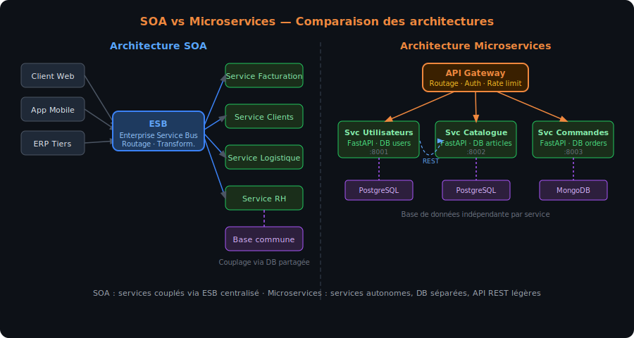
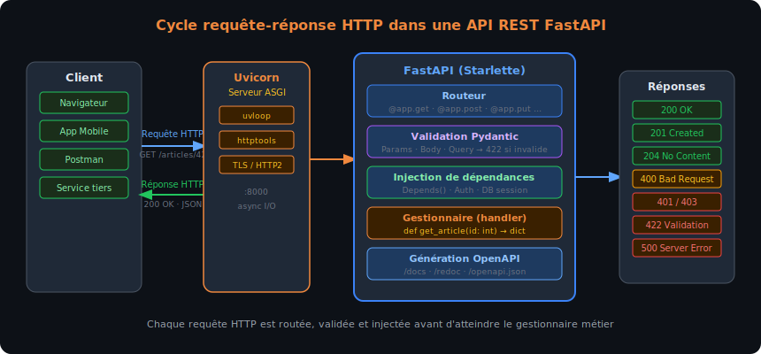
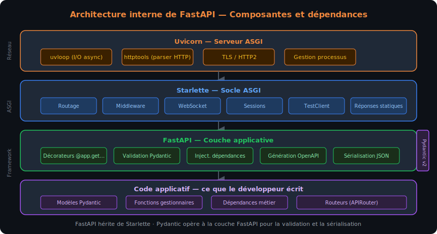

# Chapitre 1 — Découverte de FastAPI et des Web Services

## Objectifs du chapitre

À l'issue de ce chapitre, chaque stagiaire est capable de :

- Situer FastAPI dans l'écosystème des frameworks web Python et expliquer en quoi il diffère de Flask et de Django
- Décrire le cycle complet d'une requête HTTP : méthode, URL, en-têtes, corps, code de statut, corps de réponse
- Distinguer SOA et microservices, et identifier les cas d'usage typiques de chaque architecture
- Lire et comprendre une spécification OpenAPI générée automatiquement par FastAPI
- Installer un environnement de développement Python avec `venv`, `pip` et VS Code, et démarrer un serveur uvicorn
- Écrire et exposer une première route `GET` annotée avec des types Python, retournant un objet JSON
- Tester un endpoint depuis Swagger UI et depuis Postman

## Web Services — du SOAP au REST

### Qu'est-ce qu'un Web Service ?

Un Web Service est un composant logiciel accessible via un réseau (le plus souvent Internet ou un réseau d'entreprise) qui expose des fonctionnalités à d'autres applications, indépendamment du langage de programmation ou de la plateforme de chaque interlocuteur. C'est le mécanisme qui permet à une application mobile de récupérer la météo auprès d'un serveur météo, à un site e-commerce de déclencher un paiement auprès d'un prestataire bancaire, ou à un ERP d'importer des données depuis un fournisseur logistique.

La notion-clé est l'**interopérabilité** : deux applications qui ne partagent ni le même langage, ni la même base de code, ni la même infrastructure peuvent communiquer via un protocole commun et un format de données standardisé. Ce contrat d'interface remplace les intégrations point-à-point fragiles (partage de fichier CSV, accès direct à une base de données distante) par une interface stable, versionnée et testable.

> [!NOTE] Analogie
> Un Web Service ressemble à une prise électrique normalisée : peu importe ce que vous branchez (lampe, ordinateur, chargeur), la prise expose toujours le même interface. Ce qui est "branché" côté client peut changer sans que la prise elle-même soit modifiée.

### Les trois grandes familles d'architectures

Trois grandes approches se sont succédé ou coexistent dans le monde des Web Services :

**SOAP (Simple Object Access Protocol)** est une norme du W3C née en 1998, fondée sur XML et transportée indifféremment sur HTTP, SMTP ou d'autres protocoles. SOAP définit un enveloppe XML stricte, un mécanisme de fautes normalisé et un contrat de service décrit dans un fichier WSDL (Web Services Description Language). Cette rigueur en fait un choix apprécié dans les environnements d'entreprise exigeant de la traçabilité formelle (banque, assurance, secteur public) — au prix d'une verbosité et d'une complexité qui ont freiné son adoption dans les projets modernes à rythme élevé de déploiement.

**REST (Representational State Transfer)** est un style architectural décrit par Roy Fielding dans sa thèse de doctorat en 2000. Il ne définit pas un protocole au sens strict mais un ensemble de contraintes : communication sans état (chaque requête porte toutes les informations nécessaires à son traitement), identification des ressources par URL, manipulation via les méthodes HTTP standard (GET, POST, PUT, DELETE), réponses représentées généralement en JSON ou en XML. Sa simplicité et son alignement naturel sur HTTP ont contribué à son adoption massive — aujourd'hui, la grande majorité des API publiques (GitHub, Stripe, Twilio, Google Maps…) sont des API REST ou "REST-like".

**GraphQL** est un langage de requête pour API développé par Facebook en 2012 et rendu open source en 2015. Il déplace la responsabilité de la sélection des données du serveur vers le client : le client décrit exactement les champs qu'il veut recevoir, le serveur retourne uniquement ces champs. GraphQL est particulièrement adapté aux interfaces avec des besoins très variables d'un écran à l'autre (applications mobiles, Single-Page Applications complexes) — mais son modèle de schéma, de resolver et de typage fort introduit une courbe d'apprentissage plus prononcée que REST.

| Critère | SOAP | REST | GraphQL |
|---------|------|------|---------|
| Format des données | XML obligatoire | JSON, XML, texte | JSON |
| Contrat d'interface | WSDL (fichier XML) | OpenAPI (optionnel) | Schéma GraphQL (obligatoire) |
| Transport | HTTP, SMTP, etc. | HTTP uniquement | HTTP uniquement |
| Granularité des requêtes | Opérations définies côté serveur | Ressources + méthodes HTTP | Requêtes construites côté client |
| Adoption principale | Systèmes d'entreprise legacy | API publiques, microservices | Applications front-end riches |
| Courbe d'apprentissage | Élevée | Modérée | Élevée |

> [!WARN] REST ≠ HTTP
> REST est un style architectural, pas un protocole. Une API peut utiliser HTTP sans être REST (elle est alors qualifiée de "HTTP API" ou de "REST-like"). Une vraie API REST respecte les contraintes de Fielding : sans état, avec une interface uniforme, en s'appuyant sur la sémantique des méthodes HTTP. En pratique, le terme "API REST" est souvent utilisé de façon approximative pour désigner toute API JSON sur HTTP.

### SOA versus microservices

Deux philosophies d'organisation des services sont fréquemment évoquées dans les projets d'entreprise.

L'**architecture orientée services (SOA — Service-Oriented Architecture)** organise une application en services métier relativement larges, communiquant souvent via un ESB (Enterprise Service Bus) centralisé. Chaque service encapsule un domaine fonctionnel (facturation, gestion des clients, logistique) et est exposé au reste du système via des contrats normalisés (souvent SOAP/WSDL ou REST). La gouvernance est centralisée, les services sont peu nombreux et relativement couplés via l'ESB.

L'**architecture en microservices** pousse la décomposition beaucoup plus loin : chaque service est un processus indépendant, avec sa propre base de données, son propre cycle de déploiement et son propre contrat d'API. Les microservices communiquent entre eux via des API REST légères ou des messages asynchrones. L'indépendance est totale (un service peut être redéployé sans affecter les autres) — au prix d'une complexité opérationnelle (orchestration, traçabilité des appels inter-services, gestion des transactions distribuées) qui n'est pertinente qu'à partir d'une certaine taille d'équipe et de trafic.



Le schéma ci-dessus illustre la différence fondamentale entre les deux approches : SOA avec un ESB central concentrant les flux, et microservices avec des services autonomes communiquant en pair-à-pair via des API REST légères. FastAPI est typiquement utilisé dans le cadre de microservices ou de "modular monoliths" — des applications décomposées en modules bien définis sans aller jusqu'à la multiplication des processus indépendants.

FastAPI n'impose aucun style architectural particulier : il peut aussi bien servir de backend monolithique d'une application web classique que d'un microservice spécialisé dans un domaine fonctionnel précis. Ce qui compte, c'est que chaque endpoint exposé respecte les conventions REST que le Chapitre 2 détaillera.

## HTTP — le protocole sous-jacent

### Anatomie d'une requête HTTP

Une API REST repose entièrement sur HTTP. Comprendre la structure d'une requête et d'une réponse HTTP n'est pas optionnel : c'est ce qui permet de diagnostiquer un problème d'authentification, d'interpréter un code d'erreur, ou de décider quel code de statut retourner depuis un endpoint FastAPI.

Une requête HTTP comprend :

- Une **ligne de requête** : méthode (`GET`, `POST`, `PUT`, `DELETE`, `PATCH`…) + URL + version HTTP
- Des **en-têtes de requête** (headers) : métadonnées comme `Content-Type`, `Authorization`, `Accept`, `User-Agent`
- Un **corps de requête** (body) : optionnel, utilisé avec `POST`, `PUT`, `PATCH` pour transmettre des données au serveur

Une réponse HTTP comprend :

- Une **ligne de statut** : code de statut numérique + phrase associée (`200 OK`, `404 Not Found`, `422 Unprocessable Entity`…)
- Des **en-têtes de réponse** : `Content-Type`, `Content-Length`, `Set-Cookie`…
- Un **corps de réponse** : données retournées, généralement JSON pour une API REST

```
# Exemple de requête HTTP brute
GET /articles/42 HTTP/1.1
Host: api.exemple.com
Accept: application/json
Authorization: Bearer eyJhbGci...

# Réponse correspondante
HTTP/1.1 200 OK
Content-Type: application/json
Content-Length: 87

{"id": 42, "titre": "Introduction à FastAPI", "auteur": "Alice"}
```

### Les méthodes HTTP et leur sémantique

Chaque méthode HTTP véhicule une intention précise. Cette sémantique n'est pas une convention optionnelle — elle est la base du contrat REST que les clients de l'API s'attendent à trouver respecté.

| Méthode | Sémantique | Idempotent ? | Corps ? | Usage typique |
|---------|-----------|-------------|---------|--------------|
| `GET` | Lire une ressource | Oui | Non | Récupérer un article, lister des utilisateurs |
| `POST` | Créer une ressource | Non | Oui | Créer un nouvel utilisateur, soumettre un formulaire |
| `PUT` | Remplacer une ressource | Oui | Oui | Remplacer complètement un article |
| `PATCH` | Modifier partiellement | Non | Oui | Mettre à jour uniquement l'email d'un utilisateur |
| `DELETE` | Supprimer une ressource | Oui | Rare | Supprimer un article |
| `OPTIONS` | Interroger les capacités | Oui | Non | Pré-vol CORS |

> [!NOTE] Idempotence
> Une opération est **idempotente** si l'exécuter une fois ou dix fois produit le même résultat côté serveur. `DELETE /articles/42` est idempotent : que vous l'appeliez une ou cinq fois, l'article 42 sera absent. `POST /articles` n'est pas idempotent : chaque appel crée un nouvel article.

### Les codes de statut HTTP essentiels

FastAPI retourne automatiquement certains codes de statut (200 pour un `GET` réussi, 422 si la validation Pydantic échoue), mais le développeur peut et doit choisir le code approprié pour les cas d'erreur métier. Les codes se regroupent en cinq familles :

- **2xx — Succès** : `200 OK` (lecture réussie), `201 Created` (ressource créée), `204 No Content` (suppression réussie sans corps de réponse)
- **3xx — Redirection** : `301 Moved Permanently`, `304 Not Modified` (cache HTTP)
- **4xx — Erreur client** : `400 Bad Request` (requête malformée), `401 Unauthorized` (non authentifié), `403 Forbidden` (authentifié mais non autorisé), `404 Not Found` (ressource introuvable), `409 Conflict` (conflit de données), `422 Unprocessable Entity` (validation échouée)
- **5xx — Erreur serveur** : `500 Internal Server Error` (exception non gérée), `503 Service Unavailable` (service indisponible)

> [!DANGER] 401 vs 403 — une confusion fréquente
> `401 Unauthorized` signifie "je ne sais pas qui vous êtes" (jeton absent ou invalide) — malgré son nom, ce code concerne l'**authentification**, pas l'autorisation.
> `403 Forbidden` signifie "je sais qui vous êtes, mais vous n'avez pas le droit de faire ça" — c'est l'**autorisation**.
> Confondre les deux induit en erreur les clients de l'API (et les équipes de sécurité qui analysent les logs).



Le schéma ci-dessus représente le cycle complet d'une requête HTTP depuis le client jusqu'à la réponse JSON : le client envoie une requête HTTP avec méthode, URL et en-têtes ; uvicorn reçoit et transmet à FastAPI ; FastAPI route vers le bon gestionnaire, exécute la validation Pydantic, puis retourne la réponse avec le code de statut approprié.

## FastAPI — présentation, architecture et positionnement

### Naissance et positionnement

FastAPI est un framework web Python créé par Sebastián Ramírez et rendu public en 2018. En moins de cinq ans, il est devenu l'un des frameworks Python les plus populaires pour la création d'API, notamment grâce à trois caractéristiques distinctives.

**Performances élevées** : FastAPI est fondé sur [Starlette](https://www.starlette.io/) pour les couches ASGI (serveur, routage, middleware) et sur [Pydantic](https://docs.pydantic.dev/) pour la validation des données. Starlette est lui-même l'un des frameworks Python les plus rapides disponibles, proche de Node.js en termes de débit sur des benchmarks standards. Le gain est significatif par rapport à Flask (WSGI synchrone) sur des workloads I/O-bound typiques des API modernes.

**Validation automatique** : chaque paramètre d'entrée déclaré avec un type Python est automatiquement validé par Pydantic. Si un client envoie une chaîne là où un entier est attendu, FastAPI retourne un `422 Unprocessable Entity` détaillé sans que le développeur n'ait à écrire une seule ligne de code de validation manuelle.

**Documentation automatique** : FastAPI génère, à partir des annotations de type et des docstrings, une documentation OpenAPI interactive (Swagger UI et ReDoc) accessible via une URL dédiée. Cette documentation est toujours synchronisée avec le code — ce n'est pas un document maintenu séparément.

### Comparaison avec Flask et Django

Les deux autres grands frameworks Python pour le web occupent des positionnements différents.

**Flask** est un micro-framework synchrone (WSGI) né en 2010. Il est minimaliste par conception : pas d'ORM inclus, pas de validation automatique, pas de documentation auto-générée. Sa flexibilité et sa simplicité en font un choix répandu pour les petits projets, mais construire une API REST robuste avec Flask implique d'assembler plusieurs bibliothèques tierces (Flask-RESTful ou Flask-Smorest, Marshmallow pour la validation, Flasgger pour Swagger). La migration vers de l'asynchrone avec Flask-Async est possible mais reste un ajout, non la base.

**Django** est un framework "batteries included" synchrone (WSGI, avec support ASGI progressif depuis Django 3.1). Il inclut un ORM, un système d'administration, un moteur de templates et une gestion intégrée de l'authentification. Django REST Framework (DRF) ajoute la couche API REST par-dessus. Pour des projets avec des besoins CRUD complexes et une équipe familière avec l'ORM Django, DRF reste très pertinent — mais l'approche "tout-en-un" peut être surdimensionnée pour une API de microservice légère.

FastAPI se positionne entre les deux : plus opinioné que Flask (validation Pydantic intégrée, documentation auto, async natif) mais plus ciblé que Django (pas d'ORM inclus, pas de moteur de templates, pas d'admin). Il est aujourd'hui le choix par défaut de nombreuses équipes pour les nouvelles API Python.

```
# Flask — une route simple
from flask import Flask, jsonify
app = Flask(__name__)

@app.route("/articles/<int:article_id>")
def get_article(article_id):
    # Pas de validation automatique du type, pas de documentation générée
    return jsonify({"id": article_id})

# FastAPI — la même route
from fastapi import FastAPI
app = FastAPI()

@app.get("/articles/{article_id}")
def get_article(article_id: int):
    # Validation automatique : article_id est garanti entier
    # Documentation Swagger générée automatiquement
    return {"id": article_id}
```

### Architecture interne de FastAPI

FastAPI n'est pas un framework autonome — c'est une couche de haut niveau qui orchestre plusieurs bibliothèques spécialisées.



Le schéma ci-dessus détaille les couches de FastAPI : en bas, le serveur ASGI Uvicorn qui écoute les connexions HTTP ; au-dessus, Starlette qui gère le routage, le middleware, les sessions et les WebSockets ; au-dessus, FastAPI qui ajoute l'injection de dépendances, la validation Pydantic, la génération OpenAPI et les décorateurs d'opération (`@app.get`, `@app.post`…). Pydantic opère transversalement pour la validation des entrées et la sérialisation des sorties.

**Starlette** est le socle ASGI sur lequel repose FastAPI. Il fournit le routage, le support WebSocket, les middlewares (CORS, GZip, sessions), la gestion des requêtes et des réponses, et le client HTTP pour les tests. FastAPI hérite directement de la classe `Starlette` — tout ce que fait Starlette est disponible dans FastAPI.

**Pydantic** (v2 depuis FastAPI 0.100) est la bibliothèque de validation et de sérialisation de données. Elle s'appuie sur les annotations de type Python pour construire des schémas JSON et valider automatiquement les données entrantes. Un modèle Pydantic est une classe qui déclare ses champs comme des attributs annotés — Pydantic se charge de la coercition de types, de la validation des contraintes et de la sérialisation JSON.

**Uvicorn** est le serveur ASGI recommandé pour FastAPI. Il est fondé sur `uvloop` et `httptools`, deux implémentations hautes performances de la boucle d'événements asyncio et du parser HTTP. Uvicorn est utilisé en développement et en production (souvent derrière Gunicorn pour la gestion multi-processus).

> [!TIP] ASGI vs WSGI
> WSGI (Web Server Gateway Interface) est l'interface Python historique pour les serveurs web synchrones — Flask et Django (en mode classique) l'utilisent. ASGI (Asynchronous Server Gateway Interface) est son successeur, conçu pour les frameworks asynchrones. FastAPI est nativement ASGI, ce qui lui permet de gérer des milliers de connexions concurrentes sans bloquer sur les opérations I/O (appels base de données, requêtes HTTP sortantes…).

## OpenAPI et documentation automatique avec Swagger

### Qu'est-ce que la spécification OpenAPI ?

OpenAPI (anciennement Swagger) est une spécification ouverte pour décrire des API REST. Un fichier OpenAPI (JSON ou YAML) décrit l'ensemble des endpoints d'une API : URLs, méthodes HTTP supportées, paramètres, corps de requête, réponses possibles avec leurs schémas de données et leurs codes de statut. Ce fichier sert de contrat entre le fournisseur de l'API et ses consommateurs.

La version actuelle est OpenAPI 3.x, maintenue par la Swagger Initiative sous l'égide de la Linux Foundation. FastAPI génère automatiquement une spécification OpenAPI 3.0 à partir des annotations de type du code — sans aucune configuration manuelle.

### Swagger UI et ReDoc

FastAPI expose deux interfaces de documentation interactive par défaut :

- **Swagger UI** sur `/docs` : interface interactive qui permet d'explorer tous les endpoints, de lire leurs schémas de données, et d'exécuter des requêtes directement depuis le navigateur. C'est l'outil principal pour tester manuellement une API en développement.
- **ReDoc** sur `/redoc` : interface de documentation lisible orientée lecture, plus adaptée à une documentation destinée aux consommateurs de l'API.

Le fichier JSON brut de la spécification est accessible sur `/openapi.json`.

```python
# Ces URLs sont disponibles automatiquement dès qu'une application FastAPI est démarrée
# http://localhost:8000/docs       → Swagger UI
# http://localhost:8000/redoc      → ReDoc
# http://localhost:8000/openapi.json → Spécification JSON brute
```

L'avantage clé : la documentation est **synchronisée avec le code** par construction. Il est impossible d'oublier de mettre à jour la doc quand on modifie un endpoint — FastAPI régénère la spécification à chaque démarrage du serveur à partir du code source.

> [!NOTE] Enrichir la documentation
> Les métadonnées des endpoints (description, exemples de valeurs, nom d'affichage) se renseignent via les paramètres des décorateurs et les attributs des modèles Pydantic. Le Chapitre 2 détaillera comment documenter précisément chaque endpoint.

### Personnaliser les métadonnées de l'application

```python
from fastapi import FastAPI

app = FastAPI(
    title="API Catalogue",
    description="API de gestion de produits et de commandes",
    version="1.0.0",
    contact={
        "name": "Formateur Dawan",
        "email": "formation@dawan.fr",
    },
    license_info={
        "name": "MIT",
    },
)
```

Ces métadonnées apparaissent en en-tête de Swagger UI et sont intégrées dans le fichier `openapi.json`.

## Postman — tester une API

### Présentation

Postman est un client HTTP graphique qui permet de construire, envoyer et inspecter des requêtes HTTP sans écrire de code. C'est l'outil de test manuel de référence pour les développeurs d'API, aussi bien en développement que pour tester une API tierce.

Pour une API FastAPI, Postman complète Swagger UI en permettant :

- De sauvegarder des requêtes dans des collections organisées par projet
- De définir des variables d'environnement (URL de base, jeton d'authentification) réutilisables entre requêtes
- D'enchaîner des appels avec des scripts pre-request et post-response (JavaScript)
- De partager une collection avec une équipe

> [!TIP] Swagger UI ou Postman ?
> En développement, Swagger UI est plus rapide à utiliser pour tester un endpoint isolément (pas de configuration). Postman est préférable dès qu'il faut automatiser des séquences de test ou partager une collection de requêtes avec d'autres personnes.

### Tester un endpoint FastAPI depuis Postman

1. Démarrer le serveur FastAPI (voir section suivante)
2. Dans Postman, créer une nouvelle requête : méthode `GET`, URL `http://localhost:8000/`
3. Cliquer **Send** → inspecter le corps de la réponse (JSON), le code de statut (200), les en-têtes
4. Tester un endpoint `POST` : sélectionner l'onglet **Body**, choisir **raw → JSON**, saisir le corps JSON, envoyer

Pour les endpoints protégés par jeton JWT (Chapitre 3), Postman permet de définir une variable `{{token}}` dans l'environnement et de l'injecter automatiquement dans l'en-tête `Authorization: Bearer {{token}}` de toutes les requêtes de la collection.

## Installation et premier projet FastAPI

### Prérequis et installation

Python 3.11 ou supérieur est requis. L'usage d'un environnement virtuel (`venv`) est impératif pour isoler les dépendances du projet.

```bash
# 1. Vérifier la version de Python
python --version
# Python 3.11.x ou supérieur attendu

# 2. Créer un dossier de projet
mkdir api-catalogue
cd api-catalogue

# 3. Créer et activer l'environnement virtuel
python -m venv .venv

# Sous Linux/macOS
source .venv/bin/activate

# Sous Windows (PowerShell)
.venv\Scripts\Activate.ps1

# 4. Installer FastAPI et le serveur Uvicorn
pip install "fastapi[standard]"
# Installe FastAPI, Uvicorn, Pydantic, python-multipart,
# httpx (client de test), et les dépendances standard

# 5. Vérifier l'installation
pip show fastapi
# Name: fastapi
# Version: 0.115.x
```

> [!WARN] `fastapi` vs `fastapi[standard]`
> `pip install fastapi` installe uniquement le package FastAPI sans serveur. `pip install "fastapi[standard]"` installe également Uvicorn, le serveur HTTP recommandé, ainsi que les extras habituellement nécessaires en développement. Installer uniquement `fastapi` sans `uvicorn` empêche de lancer le serveur avec la commande `fastapi dev`.

### Structure d'un projet FastAPI

Un projet FastAPI simple a la structure suivante. Les projets réels, abordés au Chapitre 3, utilisent une organisation plus modulaire (routeurs séparés, couche de dépendances, schémas distincts du code métier).

```
api-catalogue/
├── .venv/                  ← Environnement virtuel (ne pas versionner)
├── main.py                 ← Point d'entrée de l'application
├── requirements.txt        ← Dépendances du projet
└── README.md
```

```python
# requirements.txt — pincer les versions en production
fastapi[standard]>=0.115.0
```

### Premier fichier `main.py`

```python
# main.py
from fastapi import FastAPI

app = FastAPI(
    title="API Catalogue",
    description="Premier projet FastAPI — formation Dawan",
    version="0.1.0",
)


@app.get("/")
def read_root():
    """Point d'entrée de l'API — retourne un message de bienvenue."""
    return {"message": "Bienvenue sur l'API Catalogue"}


@app.get("/articles/{article_id}")
def get_article(article_id: int):
    """Retourne un article fictif identifié par son ID entier."""
    return {"id": article_id, "titre": f"Article numéro {article_id}"}
```

Plusieurs points méritent d'être soulignés :

- `app = FastAPI(...)` instancie l'application. Les paramètres `title`, `description` et `version` alimentent la documentation Swagger.
- `@app.get("/")` est un **décorateur d'opération** : il enregistre la fonction `read_root` comme gestionnaire des requêtes `GET /`. Il existe `@app.post`, `@app.put`, `@app.delete`, `@app.patch` pour les autres méthodes HTTP.
- `article_id: int` est une annotation de type Python ordinaire — FastAPI l'utilise pour extraire le paramètre de chemin depuis l'URL, le convertir en entier et retourner un `422` si la conversion échoue.
- La fonction retourne un dictionnaire Python ordinaire — FastAPI le sérialise automatiquement en JSON avec les en-têtes `Content-Type: application/json` appropriés.

### Démarrer le serveur de développement

```bash
# Depuis le dossier api-catalogue, avec .venv activé

# Option 1 — CLI FastAPI (recommandé en développement)
fastapi dev main.py
# INFO: Will watch for changes in these directories: ['/path/api-catalogue']
# INFO: Uvicorn running on http://127.0.0.1:8000 (Press CTRL+C to quit)
# INFO: Started reloader process [12345] using WatchFiles
# INFO: Started server process [12346]
# INFO: Application startup complete.

# Option 2 — Uvicorn directement
uvicorn main:app --reload
```

Le flag `--reload` (actif par défaut avec `fastapi dev`) déclenche un rechargement automatique du serveur dès qu'un fichier Python du projet est modifié — indispensable en développement pour voir les modifications sans redémarrer manuellement.

Une fois le serveur démarré :
- `http://localhost:8000/` → `{"message": "Bienvenue sur l'API Catalogue"}`
- `http://localhost:8000/articles/42` → `{"id": 42, "titre": "Article numéro 42"}`
- `http://localhost:8000/docs` → Swagger UI

> [!TIP] Résultat attendu dans le terminal
> Le terminal affiche une ligne `INFO: Application startup complete.` quand le serveur est prêt. Si vous voyez une erreur `ModuleNotFoundError`, vérifiez que l'environnement virtuel est activé (le nom du venv doit apparaître au début du prompt shell).

### Explorer la documentation Swagger

Ouvrir `http://localhost:8000/docs` dans un navigateur. Swagger UI affiche :

1. Le titre et la description de l'application
2. La liste des endpoints groupés par tag (par défaut, un seul groupe "default")
3. Pour chaque endpoint : méthode HTTP (badge coloré), URL, description, bouton **Try it out**

Cliquer sur **GET /articles/{article_id}** → **Try it out** → saisir `42` dans le champ `article_id` → **Execute** → observer la requête `curl` générée, le code de réponse `200` et le corps JSON retourné.

Essayer de saisir `abc` à la place de `42` → **Execute** → observer le code `422 Unprocessable Entity` et le corps d'erreur détaillé produit par la validation Pydantic :

```json
{
  "detail": [
    {
      "type": "int_parsing",
      "loc": ["path", "article_id"],
      "msg": "Input should be a valid integer, unable to parse string as an integer",
      "input": "abc"
    }
  ]
}
```

Cette réponse structurée — retournée automatiquement sans aucun code de gestion d'erreur dans le gestionnaire — est l'un des atouts majeurs de FastAPI pour le débogage et pour les clients qui consomment l'API.

> [!NOTE] La documentation est un contrat vivant
> Chaque fois que vous ajoutez ou modifiez une route dans `main.py`, Swagger UI reflète immédiatement le changement au prochain rechargement de la page. Il n'y a pas de fichier OpenAPI à maintenir manuellement — FastAPI le génère à la volée depuis le code.

### Fichier `requirements.txt` et bonnes pratiques

Toujours tenir à jour le fichier `requirements.txt` (ou `pyproject.toml` avec `uv`/`poetry`) pour permettre à un autre développeur (ou à un pipeline CI/CD) de recréer exactement le même environnement.

```bash
# Générer requirements.txt à partir de l'environnement courant
pip freeze > requirements.txt

# Recréer l'environnement depuis requirements.txt
pip install -r requirements.txt
```

> [!WARN] Ne pas versionner le dossier `.venv`
> Ajouter `.venv/` à `.gitignore`. L'environnement virtuel contient des binaires spécifiques à l'OS et ne doit jamais être partagé via Git. Seul `requirements.txt` (ou `pyproject.toml`) est versionné — il permet à chacun de recréer l'environnement localement.

### Vérification finale

À l'issue de ce chapitre, l'environnement suivant doit fonctionner :

```bash
# Toutes ces commandes s'exécutent dans le dossier api-catalogue, .venv activé
fastapi dev main.py             # serveur démarré sans erreur
# → http://localhost:8000/      : {"message": "Bienvenue sur l'API Catalogue"}
# → http://localhost:8000/articles/5 : {"id": 5, "titre": "Article numéro 5"}
# → http://localhost:8000/docs  : Swagger UI avec 2 endpoints visibles
```

Un test depuis Postman confirme que les réponses JSON sont bien formées et que le code de statut est `200 OK`.
