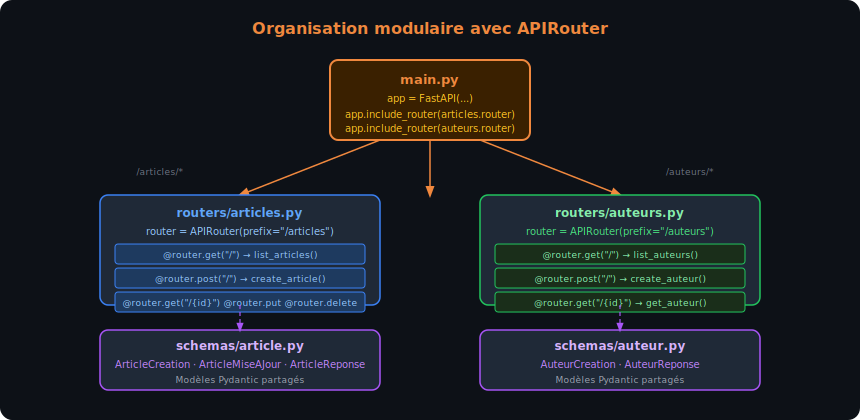
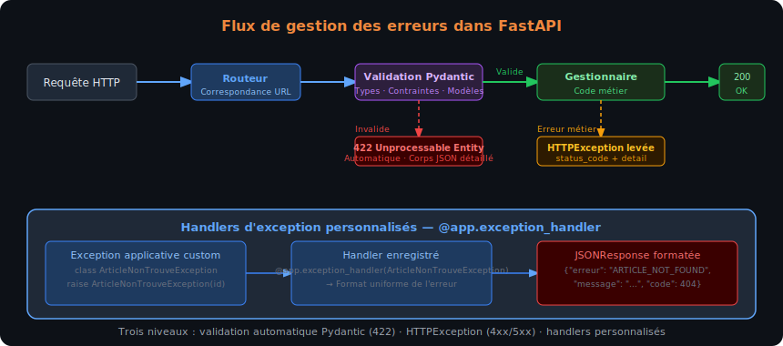

# Chapitre 2 — Implémenter des routes REST avec FastAPI

## Objectifs du chapitre

À l'issue de ce chapitre, chaque stagiaire est capable de :

- Structurer un projet FastAPI avec plusieurs routeurs (`APIRouter`) et un fichier `main.py` propre
- Déclarer des paramètres de chemin (`{id}`), de requête (`?page=2`) et de corps (JSON) avec les types appropriés
- Créer et utiliser des modèles Pydantic pour valider les entrées et filtrer les sorties
- Retourner des réponses HTTP avec le code de statut, les en-têtes et le corps corrects
- Lever des exceptions HTTP (`HTTPException`) avec le code et le message appropriés
- Écrire des gestionnaires `async def` pour les opérations I/O-bound et expliquer quand `async` est nécessaire
- Appliquer les quatre opérations CRUD (Create, Read, Update, Delete) sur une ressource fictive

## Architecture REST et organisation du code

### Ressources et URLs — la convention REST

Dans une API REST, chaque **ressource** (entité du domaine métier) est identifiée par une URL. Les URLs doivent être des noms (substantifs), jamais des verbes — c'est la méthode HTTP qui exprime l'action.

| ❌ URL avec verbe (non-REST) | ✅ URL avec nom (REST) | Méthode |
|-----------------------------|----------------------|---------|
| `/getArticles` | `/articles` | `GET` |
| `/createArticle` | `/articles` | `POST` |
| `/updateArticle/42` | `/articles/42` | `PUT` / `PATCH` |
| `/deleteArticle/42` | `/articles/42` | `DELETE` |

La convention d'URL REST pour une ressource `articles` suit un schéma systématique :

| Opération | Méthode | URL | Corps | Réponse typique |
|-----------|---------|-----|-------|----------------|
| Lister | `GET` | `/articles` | — | `200` + liste JSON |
| Créer | `POST` | `/articles` | JSON du nouvel article | `201` + article créé |
| Lire un | `GET` | `/articles/{id}` | — | `200` + article ou `404` |
| Remplacer | `PUT` | `/articles/{id}` | JSON complet | `200` + article ou `404` |
| Modifier | `PATCH` | `/articles/{id}` | JSON partiel | `200` + article ou `404` |
| Supprimer | `DELETE` | `/articles/{id}` | — | `204` ou `200` |

> [!NOTE] Ressources imbriquées
> Les ressources hiérarchiques s'expriment par imbrication d'URL : `/auteurs/7/articles` pour les articles de l'auteur 7. L'imbrication ne doit pas dépasser deux niveaux — au-delà, préférer `/articles?auteur_id=7` avec un paramètre de requête.

### Organiser le code avec APIRouter

Pour un projet de plus d'une dizaine de routes, tout mettre dans `main.py` devient ingérable. FastAPI fournit `APIRouter` pour découper l'application en modules.

```
api-bibliotheque/
├── main.py              ← Instanciation de l'app + inclusion des routeurs
├── routers/
│   ├── __init__.py
│   ├── articles.py      ← Routes /articles
│   └── auteurs.py       ← Routes /auteurs
├── schemas/
│   ├── __init__.py
│   └── article.py       ← Modèles Pydantic
└── requirements.txt
```

```python
# routers/articles.py
from fastapi import APIRouter

router = APIRouter(prefix="/articles", tags=["Articles"])

@router.get("/")
def list_articles():
    return []

@router.get("/{article_id}")
def get_article(article_id: int):
    return {"id": article_id}
```

```python
# main.py
from fastapi import FastAPI
from routers import articles, auteurs

app = FastAPI(title="API Bibliothèque", version="1.0.0")

app.include_router(articles.router)
app.include_router(auteurs.router)
```

Le paramètre `prefix="/articles"` évite de répéter `/articles` dans chaque décorateur. Le paramètre `tags=["Articles"]` groupe les routes sous un même onglet dans Swagger UI.



Le schéma ci-dessus illustre la séparation entre le point d'entrée `main.py`, qui inclut les routeurs, et les modules spécialisés (`routers/articles.py`, `routers/auteurs.py`) qui définissent les routes de chaque ressource. Les schémas Pydantic sont définis dans `schemas/` et importés par les routeurs.

## Paramètres de requête — chemin, query et corps

### Paramètres de chemin

Un paramètre de chemin est une valeur incluse dans l'URL elle-même, entre accolades dans le décorateur. FastAPI l'extrait, le convertit au type annoté et retourne `422` si la conversion échoue.

```python
from fastapi import APIRouter

router = APIRouter(prefix="/articles", tags=["Articles"])

@router.get("/{article_id}")
def get_article(article_id: int):
    """article_id est extrait de l'URL, converti en int, validé."""
    return {"id": article_id, "titre": f"Article {article_id}"}
```

Les paramètres de chemin peuvent être contraints avec des métadonnées `Path` :

```python
from fastapi import APIRouter, Path

router = APIRouter(prefix="/articles", tags=["Articles"])

@router.get("/{article_id}")
def get_article(
    article_id: int = Path(gt=0, description="Identifiant entier positif de l'article")
):
    return {"id": article_id}
```

`gt=0` (greater than 0) invalide les ID négatifs ou nuls avant même d'atteindre le code métier.

### Paramètres de requête (query parameters)

Tout paramètre de fonction qui n'est pas dans l'URL ni dans le corps est automatiquement interprété comme un paramètre de requête (`?clé=valeur`).

```python
from typing import Optional

@router.get("/")
def list_articles(
    page: int = 1,
    taille: int = 10,
    categorie: Optional[str] = None,
):
    """
    GET /articles → page=1, taille=10
    GET /articles?page=2&taille=5 → page=2, taille=5
    GET /articles?categorie=python → filtre par catégorie
    """
    return {
        "page": page,
        "taille": taille,
        "categorie": categorie,
        "articles": [],
    }
```

Les contraintes s'appliquent avec `Query` :

```python
from fastapi import Query

@router.get("/")
def list_articles(
    page: int = Query(default=1, ge=1, description="Numéro de page (commence à 1)"),
    taille: int = Query(default=10, ge=1, le=100, description="Nombre d'articles par page"),
):
    ...
```

`ge=1` (greater or equal) et `le=100` (less or equal) définissent les bornes. FastAPI retourne un `422` clair si elles sont dépassées.

### Corps de requête JSON

Pour les méthodes `POST`, `PUT` et `PATCH`, les données sont transmises dans le corps de la requête au format JSON. FastAPI déclare un corps en annotant un paramètre avec un modèle Pydantic.

```python
from pydantic import BaseModel
from fastapi import APIRouter

router = APIRouter(prefix="/articles", tags=["Articles"])

class ArticleCreation(BaseModel):
    titre: str
    contenu: str
    publie: bool = False

@router.post("/", status_code=201)
def create_article(article: ArticleCreation):
    """
    Reçoit un corps JSON :
    {"titre": "Mon article", "contenu": "...", "publie": false}
    """
    return {"id": 1, **article.model_dump()}
```

FastAPI détecte automatiquement qu'`article` est un modèle Pydantic (pas un type primitif) et le lit depuis le corps de la requête. Il génère le schéma JSON correspondant dans Swagger UI, avec les champs requis mis en évidence.

> [!WARN] `model_dump()` remplace `dict()` depuis Pydantic v2
> La méthode `dict()` des modèles Pydantic est dépréciée depuis Pydantic v2 (utilisée avec FastAPI ≥ 0.100). Utiliser `model_dump()` à la place — `dict()` fonctionne encore mais génère des avertissements de dépréciation.

## Modèles Pydantic — validation et sérialisation

### Bases de Pydantic v2

Pydantic est une bibliothèque de validation de données par annotation de type. Un modèle Pydantic est une classe qui hérite de `BaseModel` et dont les attributs sont des champs typés.

```python
from pydantic import BaseModel, Field
from datetime import datetime
from typing import Optional

class Article(BaseModel):
    id: int
    titre: str
    contenu: str
    publie: bool = False
    date_creation: datetime
    categorie: Optional[str] = None
    nb_vues: int = Field(default=0, ge=0)
```

Quand Pydantic reçoit des données (dict Python, JSON, etc.) à valider contre ce modèle :
- Les champs sans valeur par défaut sont **obligatoires** (`id`, `titre`, `contenu`, `date_creation`)
- Les champs avec valeur par défaut sont **optionnels** (`publie`, `categorie`, `nb_vues`)
- Pydantic effectue de la **coercition de type** : la chaîne `"42"` est automatiquement convertie en `int` pour un champ `int`
- Si un champ obligatoire est absent ou si la coercition échoue, Pydantic lève une `ValidationError` que FastAPI transforme en `422`

### Schémas d'entrée vs schémas de sortie

Un principe clé en API REST : les données reçues (entrée) ne sont pas nécessairement les mêmes que les données exposées (sortie). Il est courant de définir plusieurs modèles pour la même entité.

```python
from pydantic import BaseModel, Field
from datetime import datetime
from typing import Optional

# Modèle pour la CRÉATION (entrée) — pas d'id ni de date (générés côté serveur)
class ArticleCreation(BaseModel):
    titre: str = Field(min_length=3, max_length=200)
    contenu: str = Field(min_length=10)
    categorie: Optional[str] = None

# Modèle pour la MODIFICATION partielle (entrée) — tous les champs optionnels
class ArticleMiseAJour(BaseModel):
    titre: Optional[str] = Field(default=None, min_length=3, max_length=200)
    contenu: Optional[str] = Field(default=None, min_length=10)
    categorie: Optional[str] = None

# Modèle pour la RÉPONSE (sortie) — inclut id, date et champs calculés
class ArticleReponse(BaseModel):
    id: int
    titre: str
    contenu: str
    categorie: Optional[str]
    publie: bool
    date_creation: datetime
    nb_vues: int

    model_config = {"from_attributes": True}  # Permet la création depuis un ORM (Chapitre 4)
```

La séparation entrée/sortie permet de :
- Empêcher les stagiaires d'injecter des champs comme `id` ou `date_creation` lors de la création
- Masquer des champs sensibles (mot de passe hashé) de la réponse
- Documenter séparément les schémas d'entrée et de sortie dans Swagger UI

### Valider des types courants avec Field

```python
from pydantic import BaseModel, Field, EmailStr
from typing import List

class Auteur(BaseModel):
    nom: str = Field(min_length=2, max_length=100)
    email: EmailStr                                    # Valide le format email
    age: int = Field(ge=18, le=120)
    tags: List[str] = Field(default_factory=list)     # Liste vide par défaut
    biographie: str = Field(default="", max_length=2000)
```

> [!NOTE] `EmailStr` nécessite `email-validator`
> Pour utiliser `EmailStr`, installez : `pip install "pydantic[email]"`. Ce validateur vérifie la syntaxe de l'email (présence du `@`, domaine valide) mais n'envoie pas de mail de vérification.

### `response_model` — filtrer la sortie

Le paramètre `response_model` d'un décorateur de route indique à FastAPI quel modèle utiliser pour sérialiser et filtrer la réponse. Cela garantit que les champs non présents dans le modèle de sortie ne sont jamais exposés.

```python
# Base de données fictive en mémoire
articles_db: list[dict] = [
    {"id": 1, "titre": "Intro FastAPI", "contenu": "...", "publie": True,
     "date_creation": "2024-01-15T10:00:00", "nb_vues": 150, "categorie": "python",
     "mot_de_passe_interne": "ne_pas_exposer"},  # Champ interne
]

@router.get("/{article_id}", response_model=ArticleReponse)
def get_article(article_id: int):
    article = next((a for a in articles_db if a["id"] == article_id), None)
    if article is None:
        raise HTTPException(status_code=404, detail="Article introuvable")
    return article
    # mot_de_passe_interne ne sera PAS dans la réponse — filtré par response_model
```

> [!DANGER] Ne jamais retourner plus que nécessaire
> Sans `response_model`, FastAPI sérialise le dictionnaire entier retourné par le gestionnaire — y compris les champs sensibles (jetons, mots de passe hashés, données internes). Toujours définir un `response_model` explicite pour les routes qui retournent des entités.

## Réponses HTTP — codes, en-têtes et formats

### Codes de statut avec `status_code`

Par défaut, FastAPI retourne `200 OK` pour toutes les routes. Pour changer le code de succès, utiliser le paramètre `status_code` du décorateur.

```python
from fastapi import APIRouter
from fastapi.responses import Response

router = APIRouter(prefix="/articles", tags=["Articles"])

@router.post("/", status_code=201)           # 201 Created pour la création
def create_article(article: ArticleCreation) -> ArticleReponse:
    ...

@router.delete("/{article_id}", status_code=204)  # 204 No Content pour la suppression
def delete_article(article_id: int):
    ...
    return None  # Corps vide pour 204
```

### Retourner une `Response` personnalisée

Pour contrôler précisément les en-têtes ou le contenu, retourner une instance `Response` (ou une de ses sous-classes).

```python
from fastapi.responses import JSONResponse, Response

@router.get("/{article_id}")
def get_article(article_id: int):
    article = get_from_db(article_id)
    if article is None:
        return JSONResponse(
            status_code=404,
            content={"detail": "Article introuvable", "id": article_id}
        )
    return JSONResponse(
        content=article,
        headers={"X-Article-Categorie": article.get("categorie", "")},
    )
```

Dans la pratique, lever une `HTTPException` (section suivante) est plus courant que retourner un `JSONResponse` d'erreur manuellement.

## Gestion des erreurs HTTP

### HTTPException

`HTTPException` est l'exception FastAPI à lever pour retourner une réponse d'erreur HTTP structurée. Elle interrompt immédiatement l'exécution du gestionnaire et retourne une réponse JSON avec le code et le message fournis.

```python
from fastapi import APIRouter, HTTPException

router = APIRouter(prefix="/articles", tags=["Articles"])

# Base de données fictive
articles_db: dict[int, dict] = {
    1: {"id": 1, "titre": "Intro FastAPI", "contenu": "...", "publie": True},
    2: {"id": 2, "titre": "Pydantic v2", "contenu": "...", "publie": False},
}

@router.get("/{article_id}", response_model=ArticleReponse)
def get_article(article_id: int):
    if article_id not in articles_db:
        raise HTTPException(
            status_code=404,
            detail=f"Article {article_id} introuvable"
        )
    return articles_db[article_id]
```

La réponse générée est :
```json
HTTP/1.1 404 Not Found
Content-Type: application/json

{"detail": "Article 99 introuvable"}
```

Le champ `detail` peut être une chaîne, un dictionnaire ou une liste — FastAPI le sérialise tel quel dans le corps JSON.

```python
# Erreur avec corps détaillé
raise HTTPException(
    status_code=422,
    detail=[
        {"field": "titre", "msg": "Le titre existe déjà"},
        {"field": "categorie", "msg": "Catégorie non reconnue"},
    ]
)
```

### Handlers d'exception personnalisés

Pour personnaliser globalement le format de réponse d'une exception, enregistrer un handler avec `@app.exception_handler`.

```python
from fastapi import FastAPI, Request
from fastapi.responses import JSONResponse

app = FastAPI()

class ArticleNonTrouveException(Exception):
    def __init__(self, article_id: int):
        self.article_id = article_id

@app.exception_handler(ArticleNonTrouveException)
async def article_not_found_handler(request: Request, exc: ArticleNonTrouveException):
    return JSONResponse(
        status_code=404,
        content={
            "erreur": "ARTICLE_NOT_FOUND",
            "message": f"L'article {exc.article_id} n'existe pas",
            "code": 404,
        },
    )

@app.get("/articles/{article_id}")
def get_article(article_id: int):
    if article_id not in articles_db:
        raise ArticleNonTrouveException(article_id=article_id)
    return articles_db[article_id]
```

Ce mécanisme permet de centraliser le format des erreurs de l'API et d'assurer leur cohérence sans dupliquer le code de formatage dans chaque gestionnaire.



Le schéma ci-dessus représente les trois niveaux de gestion des erreurs dans FastAPI : la validation automatique Pydantic (422), les `HTTPException` levées dans le code métier, et les handlers d'exception personnalisés pour les erreurs applicatives.

## CRUD complet — exemple avec une ressource en mémoire

Voici un module complet implémentant les quatre opérations CRUD sur une ressource `articles` stockée en mémoire. Cet exemple synthétise les notions précédentes.

```python
# routers/articles.py
from fastapi import APIRouter, HTTPException, Path, Query
from pydantic import BaseModel, Field
from datetime import datetime
from typing import Optional, List

router = APIRouter(prefix="/articles", tags=["Articles"])

# --- Schémas Pydantic ---

class ArticleCreation(BaseModel):
    titre: str = Field(min_length=3, max_length=200)
    contenu: str = Field(min_length=10)
    categorie: Optional[str] = None

class ArticleMiseAJour(BaseModel):
    titre: Optional[str] = Field(default=None, min_length=3, max_length=200)
    contenu: Optional[str] = Field(default=None, min_length=10)
    categorie: Optional[str] = None

class ArticleReponse(BaseModel):
    id: int
    titre: str
    contenu: str
    categorie: Optional[str]
    publie: bool
    date_creation: datetime

# --- Base de données simulée ---

_compteur_id = 0
articles_db: dict[int, dict] = {}

def _nouvel_id() -> int:
    global _compteur_id
    _compteur_id += 1
    return _compteur_id

# --- Routes ---

@router.get("/", response_model=List[ArticleReponse])
def list_articles(
    page: int = Query(default=1, ge=1),
    taille: int = Query(default=10, ge=1, le=100),
    categorie: Optional[str] = None,
):
    """Liste les articles avec pagination et filtre optionnel par catégorie."""
    articles = list(articles_db.values())
    if categorie:
        articles = [a for a in articles if a.get("categorie") == categorie]
    debut = (page - 1) * taille
    return articles[debut : debut + taille]


@router.post("/", response_model=ArticleReponse, status_code=201)
def create_article(article: ArticleCreation):
    """Crée un nouvel article et retourne l'article créé avec son ID."""
    nouvel_id = _nouvel_id()
    nouvel_article = {
        "id": nouvel_id,
        **article.model_dump(),
        "publie": False,
        "date_creation": datetime.utcnow(),
    }
    articles_db[nouvel_id] = nouvel_article
    return nouvel_article


@router.get("/{article_id}", response_model=ArticleReponse)
def get_article(article_id: int = Path(gt=0)):
    """Retourne l'article correspondant à l'ID ou 404."""
    if article_id not in articles_db:
        raise HTTPException(status_code=404, detail=f"Article {article_id} introuvable")
    return articles_db[article_id]


@router.put("/{article_id}", response_model=ArticleReponse)
def replace_article(article_id: int, article: ArticleCreation):
    """Remplace complètement l'article (PUT = remplacement total)."""
    if article_id not in articles_db:
        raise HTTPException(status_code=404, detail=f"Article {article_id} introuvable")
    articles_db[article_id].update({
        **article.model_dump(),
        "date_creation": articles_db[article_id]["date_creation"],  # Conserve la date d'origine
    })
    return articles_db[article_id]


@router.patch("/{article_id}", response_model=ArticleReponse)
def update_article(article_id: int, article: ArticleMiseAJour):
    """Met à jour partiellement l'article (PATCH = modification partielle)."""
    if article_id not in articles_db:
        raise HTTPException(status_code=404, detail=f"Article {article_id} introuvable")
    mises_a_jour = article.model_dump(exclude_none=True)  # Ignore les champs None
    articles_db[article_id].update(mises_a_jour)
    return articles_db[article_id]


@router.delete("/{article_id}", status_code=204)
def delete_article(article_id: int = Path(gt=0)):
    """Supprime l'article ou retourne 404."""
    if article_id not in articles_db:
        raise HTTPException(status_code=404, detail=f"Article {article_id} introuvable")
    del articles_db[article_id]
```

> [!TIP] `exclude_none=True` pour le PATCH
> `model_dump(exclude_none=True)` retourne uniquement les champs dont la valeur n'est pas `None`. C'est le mécanisme clé du `PATCH` : si le client n'envoie que `{"titre": "Nouveau titre"}`, seul `titre` est mis à jour — `contenu` et `categorie` restent inchangés dans la base.

## Traitements asynchrones avec async/await

### Quand utiliser `async def` ?

FastAPI supporte à la fois les fonctions synchrones (`def`) et asynchrones (`async def`). Le choix dépend des opérations effectuées dans le gestionnaire.

**Utiliser `async def`** quand le gestionnaire effectue des opérations I/O-bound qui ont un équivalent asynchrone : requêtes base de données (SQLAlchemy async, Tortoise ORM), appels HTTP sortants (httpx), lecture/écriture de fichiers (aiofiles), appels à des services externes.

**Utiliser `def`** quand le gestionnaire effectue uniquement des calculs CPU-bound ou des opérations synchrones sans alternative async disponible. FastAPI exécute automatiquement les fonctions synchrones dans un thread pool pour éviter de bloquer la boucle d'événements.

```python
import asyncio
import httpx

# Gestionnaire asynchrone — approprié car attend une réponse réseau
@router.get("/meteo/{ville}")
async def get_meteo(ville: str):
    """Interroge une API météo tierce — opération I/O réseau."""
    async with httpx.AsyncClient() as client:
        response = await client.get(
            f"https://api.exemple-meteo.com/v1/current?q={ville}"
        )
        response.raise_for_status()
        return response.json()

# Gestionnaire synchrone — approprié pour du calcul pur
@router.get("/calcul/{n}")
def calcul_fibonacci(n: int):
    """Calcul CPU-bound — pas d'I/O, synchrone est correct."""
    a, b = 0, 1
    for _ in range(n):
        a, b = b, a + b
    return {"n": n, "resultat": a}
```

> [!WARN] Ne pas bloquer la boucle d'événements dans un `async def`
> Dans un gestionnaire `async def`, éviter les appels bloquants synchrones (ex. `time.sleep()`, `requests.get()`, opérations SQLAlchemy synchrones lentes). Ces appels bloquent la boucle d'événements entière et annulent tout le bénéfice de l'asynchrone. Utiliser les équivalents async : `await asyncio.sleep()`, `httpx.AsyncClient`, SQLAlchemy async.

### Paralléliser des appels asynchrones

L'un des avantages de `async/await` est la parallélisation de plusieurs opérations I/O indépendantes.

```python
import asyncio
import httpx

@router.get("/tableau-de-bord")
async def get_tableau_de_bord(utilisateur_id: int):
    """
    Récupère en parallèle les données utilisateur, ses commandes et ses notifications.
    Sans async : 3 appels séquentiels → ~900ms.
    Avec asyncio.gather : 3 appels parallèles → ~300ms.
    """
    async with httpx.AsyncClient() as client:
        profil_tache = client.get(f"/users/{utilisateur_id}")
        commandes_tache = client.get(f"/orders?user={utilisateur_id}")
        notifs_tache = client.get(f"/notifications?user={utilisateur_id}")

        profil, commandes, notifs = await asyncio.gather(
            profil_tache, commandes_tache, notifs_tache
        )

    return {
        "profil": profil.json(),
        "commandes": commandes.json(),
        "notifications": notifs.json(),
    }
```

`asyncio.gather()` lance les trois coroutines en parallèle et attend que toutes trois soient terminées. La durée totale est celle de la plus lente — pas la somme des trois.

### Contexte de vie de l'application — lifespan

Pour initialiser des ressources partagées (pool de connexions base de données, client HTTP réutilisable) au démarrage de l'application et les libérer à l'arrêt, FastAPI fournit le gestionnaire de contexte `lifespan`.

```python
from contextlib import asynccontextmanager
from fastapi import FastAPI

@asynccontextmanager
async def lifespan(app: FastAPI):
    # Code exécuté au DÉMARRAGE (avant de traiter les premières requêtes)
    print("Démarrage de l'application — initialisation des ressources")
    app.state.http_client = httpx.AsyncClient()
    yield  # L'application est opérationnelle entre les deux
    # Code exécuté À L'ARRÊT (après la dernière requête)
    await app.state.http_client.aclose()
    print("Arrêt de l'application — ressources libérées")

app = FastAPI(lifespan=lifespan)
```

Le gestionnaire `lifespan` remplace les événements `startup` et `shutdown` dépréciés depuis FastAPI 0.93.

> [!NOTE] `app.state` pour les ressources partagées
> `app.state` est un namespace attaché à l'application FastAPI, accessible depuis n'importe quel gestionnaire via `request.app.state`. C'est le mécanisme recommandé pour partager un pool de connexions ou un client HTTP entre toutes les requêtes — à distinguer des dépendances (Chapitre 3) qui créent des ressources **par requête**.

## Validation avancée des données

### Validators Pydantic v2

Pour des validations métier non exprimables avec `Field`, Pydantic v2 fournit les décorateurs `@field_validator` et `@model_validator`.

```python
from pydantic import BaseModel, Field, field_validator, model_validator
from typing import Optional
import re

class ArticleCreation(BaseModel):
    titre: str = Field(min_length=3, max_length=200)
    slug: Optional[str] = None
    contenu: str = Field(min_length=10)
    tags: list[str] = Field(default_factory=list)

    @field_validator("slug")
    @classmethod
    def slug_format_valide(cls, v: Optional[str]) -> Optional[str]:
        """Le slug ne peut contenir que des lettres minuscules, chiffres et tirets."""
        if v is not None and not re.match(r"^[a-z0-9-]+$", v):
            raise ValueError("Le slug ne peut contenir que des caractères a-z, 0-9 et -")
        return v

    @field_validator("tags")
    @classmethod
    def tags_en_minuscules(cls, v: list[str]) -> list[str]:
        return [tag.lower().strip() for tag in v]

    @model_validator(mode="after")
    def generer_slug_si_absent(self) -> "ArticleCreation":
        """Génère automatiquement un slug depuis le titre si non fourni."""
        if self.slug is None:
            self.slug = re.sub(r"[^a-z0-9]+", "-", self.titre.lower()).strip("-")
        return self
```

Le `@field_validator` est appelé pour un champ spécifique. Le `@model_validator(mode="after")` est appelé après que tous les champs ont été validés, avec accès à l'objet entier.

### Types union et discriminants

```python
from typing import Union, Literal
from pydantic import BaseModel

class ArticleTexte(BaseModel):
    type: Literal["texte"]
    titre: str
    contenu: str

class ArticleVideo(BaseModel):
    type: Literal["video"]
    titre: str
    url_video: str
    duree_secondes: int

# Union discriminante — Pydantic choisit le bon modèle selon `type`
TypeArticle = Union[ArticleTexte, ArticleVideo]
```

Ce pattern évite une explosion de routes séparées quand plusieurs variantes d'une ressource coexistent.

## Documenter les endpoints

### Enrichir la documentation Swagger

```python
@router.post(
    "/",
    response_model=ArticleReponse,
    status_code=201,
    summary="Créer un article",
    description="""
Crée un nouvel article dans la base de données.

L'identifiant est généré automatiquement côté serveur.
La date de création est définie au moment de la requête.
""",
    response_description="L'article créé avec son identifiant et sa date de création",
    responses={
        409: {"description": "Un article avec ce titre existe déjà"},
    },
)
def create_article(article: ArticleCreation):
    ...
```

Les paramètres `summary`, `description` et `response_description` alimentent directement Swagger UI. Le paramètre `responses` permet de documenter les codes d'erreur non-standards pour que les consommateurs de l'API sachent les traiter.

### Tags et groupes

```python
from fastapi import FastAPI

app = FastAPI(
    openapi_tags=[
        {"name": "Articles", "description": "Gestion des articles du catalogue"},
        {"name": "Auteurs", "description": "Gestion des profils auteurs"},
        {"name": "Santé", "description": "Endpoints de monitoring"},
    ]
)
```

Les tags correspondent aux `tags=["Articles"]` passés aux `APIRouter` et organisent visuellement les endpoints dans Swagger UI.
