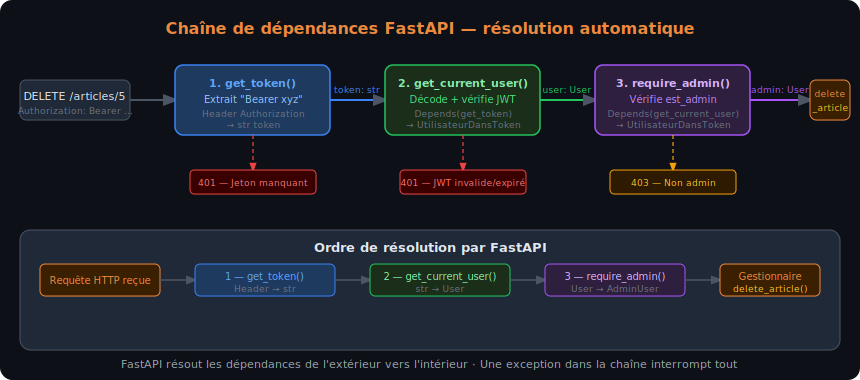
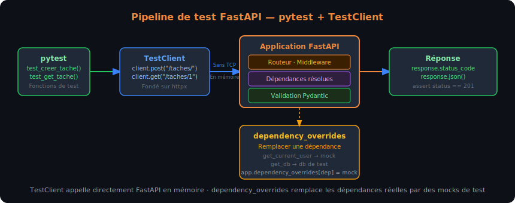

# Chapitre 3 — Sécurité, dépendances et déploiement FastAPI

## Objectifs du chapitre

À l'issue de ce chapitre, chaque stagiaire est capable de :

- Décrire le principe de l'injection de dépendances et l'implémenter avec `Depends()`
- Implémenter le flux OAuth2 Password avec génération et validation de jetons JWT
- Protéger des routes avec une dépendance d'authentification, en distinguant 401 et 403
- Configurer le middleware CORS pour autoriser les appels cross-origin d'un frontend
- Créer et envoyer des tâches de fond (`BackgroundTasks`) sans bloquer la réponse
- Écrire des tests unitaires et d'intégration pour une API FastAPI avec `pytest` et `TestClient`
- Rédiger un `Dockerfile` pour une application FastAPI et l'exécuter avec Docker Compose

## Le système de dépendances de FastAPI

### Principe de l'injection de dépendances

L'injection de dépendances (Dependency Injection, DI) est un patron de conception dans lequel un composant reçoit ses dépendances de l'extérieur plutôt que de les instancier lui-même. FastAPI fournit un système de DI déclaratif : une fonction peut déclarer qu'elle "dépend" d'une autre fonction, et FastAPI s'occupe d'appeler la dépendance avant d'appeler le gestionnaire, en lui passant le résultat.

```python
from fastapi import Depends, FastAPI

app = FastAPI()

# Dépendance — fonction ordinaire qui retourne quelque chose
def get_query_params(q: str = "", page: int = 1, taille: int = 10):
    return {"q": q, "page": page, "taille": taille}

# Gestionnaire qui consomme la dépendance via Depends()
@app.get("/recherche")
def recherche(params: dict = Depends(get_query_params)):
    return {"resultats": [], "pagination": params}
```

L'avantage est la réutilisabilité : `get_query_params` peut être injectée dans dix gestionnaires différents sans dupliquer le code de lecture et de validation des paramètres de pagination.

### Dépendances chaînées

Les dépendances peuvent dépendre d'autres dépendances, formant une chaîne que FastAPI résout automatiquement.

```python
from fastapi import Depends, HTTPException, Header
from typing import Optional

# Dépendance de bas niveau — extraire le jeton de l'en-tête
def get_token(authorization: Optional[str] = Header(default=None)) -> str:
    if authorization is None or not authorization.startswith("Bearer "):
        raise HTTPException(status_code=401, detail="Jeton manquant")
    return authorization.removeprefix("Bearer ").strip()

# Dépendance de niveau intermédiaire — valider le jeton et retourner l'utilisateur
def get_current_user(token: str = Depends(get_token)) -> dict:
    # La validation JWT complète est décrite dans la section suivante
    user = verifier_jeton(token)  # Lève 401 si invalide
    return user

# Dépendance de haut niveau — vérifier que l'utilisateur est admin
def require_admin(user: dict = Depends(get_current_user)) -> dict:
    if not user.get("est_admin"):
        raise HTTPException(status_code=403, detail="Accès réservé aux administrateurs")
    return user

# Utilisation dans un gestionnaire
@app.delete("/articles/{id}")
def delete_article(article_id: int, admin: dict = Depends(require_admin)):
    # Ici, admin est garanti admin (sinon 401 ou 403 levé avant)
    ...
```



Le schéma ci-dessus illustre la chaîne de résolution des dépendances : FastAPI appelle `get_token` en premier, passe son résultat à `get_current_user`, passe son résultat à `require_admin`, puis enfin exécute `delete_article`. Si l'une des dépendances lève une `HTTPException`, FastAPI interrompt la chaîne et retourne l'erreur sans jamais atteindre le gestionnaire.

### Dépendances de classe

Pour les dépendances configurables, un pattern courant est d'utiliser une classe avec `__call__` :

```python
class VerifierRole:
    def __init__(self, role_requis: str):
        self.role_requis = role_requis

    def __call__(self, user: dict = Depends(get_current_user)) -> dict:
        if user.get("role") != self.role_requis:
            raise HTTPException(
                status_code=403,
                detail=f"Rôle '{self.role_requis}' requis"
            )
        return user

# Crée des dépendances paramétrées réutilisables
require_editor = VerifierRole(role_requis="editeur")
require_admin = VerifierRole(role_requis="admin")

@app.post("/articles/")
def create_article(article: ArticleCreation, user: dict = Depends(require_editor)):
    ...

@app.delete("/articles/{id}")
def delete_article(article_id: int, user: dict = Depends(require_admin)):
    ...
```

## Authentification OAuth2 et JWT

### Vocabulaire : authentification et autorisation

Deux concepts souvent confondus dans les équipes de développement.

**L'authentification** répond à la question "Qui êtes-vous ?". Elle vérifie l'identité de l'appelant — le plus souvent en lui demandant un couple identifiant/mot de passe, ou en vérifiant un jeton que l'appelant présente.

**L'autorisation** répond à la question "Avez-vous le droit de faire cela ?". Elle vérifie que l'identité confirmée possède les permissions nécessaires pour effectuer l'opération demandée.

FastAPI fournit les outils pour implémenter les deux, sans imposer de stratégie particulière. La section suivante implémente le flux OAuth2 Password — le plus courant pour les API REST avec authentification par identifiant/mot de passe.

### JWT — JSON Web Token

Un JWT est un jeton signé numériquement qui encode un payload JSON. Il est composé de trois parties séparées par des points :

- **Header** : algorithme de signature et type de jeton
- **Payload** : données (claims) — identifiant utilisateur, rôle, date d'expiration
- **Signature** : hash du header + payload avec une clé secrète

```
eyJhbGciOiJIUzI1NiIsInR5cCI6IkpXVCJ9.
eyJzdWIiOiJ1c2VyXzQyIiwiZXhwIjoxNzM1MDAwMDAwfQ.
SflKxwRJSMeKKF2QT4fwpMeJf36POk6yJV_adQssw5c
```

La propriété clé : le serveur peut **vérifier** un JWT sans l'avoir stocké (stateless). Il suffit de re-calculer la signature avec la clé secrète et de comparer. Si elle correspond et si le jeton n'est pas expiré, le jeton est valide.

> [!WARN] Ne jamais stocker de données sensibles dans le payload JWT
> Le payload d'un JWT est **encodé** en Base64, pas chiffré — n'importe qui peut le décoder sans la clé secrète. Ne jamais y mettre de mot de passe, de clé privée ou de données personnelles sensibles. Le payload sert à transporter des identifiants et des droits, pas des secrets.

### Implémentation complète — OAuth2 Password Flow avec JWT

```bash
pip install "python-jose[cryptography]" "passlib[bcrypt]"
```

```python
# auth.py — module d'authentification complet
from datetime import datetime, timedelta
from typing import Optional

from fastapi import Depends, HTTPException, status
from fastapi.security import OAuth2PasswordBearer, OAuth2PasswordRequestForm
from jose import JWTError, jwt
from passlib.context import CryptContext
from pydantic import BaseModel

# Configuration — en production, charger depuis les variables d'environnement
SECRET_KEY = "une-cle-secrete-longue-et-aleatoire-a-changer-en-production"
ALGORITHM = "HS256"
EXPIRE_MINUTES = 30

# Hachage des mots de passe avec bcrypt
pwd_context = CryptContext(schemes=["bcrypt"], deprecated="auto")

# Schéma OAuth2 Password — l'URL du endpoint de login
oauth2_scheme = OAuth2PasswordBearer(tokenUrl="/auth/token")


# --- Modèles ---

class TokenReponse(BaseModel):
    access_token: str
    token_type: str

class UtilisateurDansToken(BaseModel):
    username: str
    est_admin: bool = False


# --- Base de données simulée (remplacée par SQLAlchemy au Chapitre 5) ---

UTILISATEURS_DB = {
    "alice": {
        "username": "alice",
        "hashed_password": pwd_context.hash("secret"),
        "est_admin": False,
    },
    "bob": {
        "username": "bob",
        "hashed_password": pwd_context.hash("admin123"),
        "est_admin": True,
    },
}


# --- Fonctions utilitaires ---

def verifier_mot_de_passe(plain: str, hashed: str) -> bool:
    return pwd_context.verify(plain, hashed)

def creer_jeton(data: dict, expire_delta: Optional[timedelta] = None) -> str:
    payload = data.copy()
    expire = datetime.utcnow() + (expire_delta or timedelta(minutes=EXPIRE_MINUTES))
    payload["exp"] = expire
    return jwt.encode(payload, SECRET_KEY, algorithm=ALGORITHM)

def authentifier_utilisateur(username: str, password: str) -> Optional[dict]:
    user = UTILISATEURS_DB.get(username)
    if not user or not verifier_mot_de_passe(password, user["hashed_password"]):
        return None
    return user


# --- Dépendances d'authentification ---

async def get_current_user(token: str = Depends(oauth2_scheme)) -> UtilisateurDansToken:
    credentials_exception = HTTPException(
        status_code=status.HTTP_401_UNAUTHORIZED,
        detail="Jeton invalide ou expiré",
        headers={"WWW-Authenticate": "Bearer"},
    )
    try:
        payload = jwt.decode(token, SECRET_KEY, algorithms=[ALGORITHM])
        username: str = payload.get("sub")
        if username is None:
            raise credentials_exception
    except JWTError:
        raise credentials_exception

    user = UTILISATEURS_DB.get(username)
    if user is None:
        raise credentials_exception
    return UtilisateurDansToken(**user)


async def require_admin(
    current_user: UtilisateurDansToken = Depends(get_current_user),
) -> UtilisateurDansToken:
    if not current_user.est_admin:
        raise HTTPException(
            status_code=status.HTTP_403_FORBIDDEN,
            detail="Droits administrateur requis",
        )
    return current_user
```

```python
# routers/auth.py — endpoint de login
from fastapi import APIRouter, Depends, HTTPException, status
from fastapi.security import OAuth2PasswordRequestForm
from auth import authentifier_utilisateur, creer_jeton, TokenReponse

router = APIRouter(prefix="/auth", tags=["Authentification"])

@router.post("/token", response_model=TokenReponse)
async def login(form_data: OAuth2PasswordRequestForm = Depends()):
    user = authentifier_utilisateur(form_data.username, form_data.password)
    if not user:
        raise HTTPException(
            status_code=status.HTTP_401_UNAUTHORIZED,
            detail="Identifiant ou mot de passe incorrect",
            headers={"WWW-Authenticate": "Bearer"},
        )
    token = creer_jeton({"sub": user["username"]})
    return {"access_token": token, "token_type": "bearer"}
```

```python
# Utilisation dans un routeur protégé
from auth import get_current_user, require_admin, UtilisateurDansToken

@router.get("/profil", response_model=UtilisateurDansToken)
async def get_profil(user: UtilisateurDansToken = Depends(get_current_user)):
    """Route protégée — nécessite un jeton valide."""
    return user

@router.delete("/articles/{id}", status_code=204)
async def delete_article(
    article_id: int,
    admin: UtilisateurDansToken = Depends(require_admin),
):
    """Route protégée — nécessite un jeton admin."""
    ...
```

> [!DANGER] Clé secrète en production
> `SECRET_KEY` ne doit **jamais** être codée en dur dans le code source. Utiliser une variable d'environnement ou un gestionnaire de secrets (AWS Secrets Manager, HashiCorp Vault). Générer une clé avec : `openssl rand -hex 32`. Une clé exposée dans Git compromet tous les jetons émis.

### Tester l'authentification dans Swagger UI

FastAPI intègre nativement le bouton **Authorize** dans Swagger UI quand `OAuth2PasswordBearer` est utilisé. Cliquer sur **Authorize**, saisir le nom d'utilisateur et le mot de passe, valider — Swagger UI injecte automatiquement le jeton `Bearer` dans toutes les requêtes suivantes.

## Middleware et CORS

### Principe du middleware

Un middleware est une couche de traitement qui s'interpose entre la réception d'une requête et son envoi au gestionnaire, et/ou entre la réponse du gestionnaire et son envoi au client. C'est le bon endroit pour les préoccupations transversales : logging, mesure du temps de réponse, ajout d'en-têtes, limitation de débit.

```python
import time
from fastapi import FastAPI, Request

app = FastAPI()

@app.middleware("http")
async def ajouter_duree_traitement(request: Request, call_next):
    debut = time.perf_counter()
    response = await call_next(request)
    duree = time.perf_counter() - debut
    response.headers["X-Process-Time"] = f"{duree:.4f}s"
    return response
```

`call_next` est une coroutine qui appelle le prochain middleware (ou le gestionnaire final) dans la chaîne. Le middleware peut modifier la requête avant l'appel et la réponse après.

### CORS — Cross-Origin Resource Sharing

Le CORS est un mécanisme de sécurité des navigateurs qui bloque les requêtes HTTP vers un domaine différent de celui de la page web en cours. Si un frontend React sur `localhost:3000` appelle une API FastAPI sur `localhost:8000`, le navigateur bloque la requête — à moins que le serveur ne déclare explicitement autoriser ces origines.

```python
from fastapi import FastAPI
from fastapi.middleware.cors import CORSMiddleware

app = FastAPI()

app.add_middleware(
    CORSMiddleware,
    allow_origins=[
        "http://localhost:3000",          # Frontend React en développement
        "https://www.monapp.fr",          # Frontend en production
    ],
    allow_credentials=True,              # Autorise les cookies cross-origin
    allow_methods=["GET", "POST", "PUT", "PATCH", "DELETE", "OPTIONS"],
    allow_headers=["*"],                 # Autorise tous les en-têtes
)
```

> [!WARN] Ne jamais utiliser `allow_origins=["*"]` en production avec `allow_credentials=True`
> `allow_origins=["*"]` autorise n'importe quel domaine, ce qui annule la protection CORS. Combiné avec `allow_credentials=True` (qui autorise les cookies), cela crée une faille de sécurité critique (attaques CSRF). En développement, il est toléré ; en production, toujours lister explicitement les origines autorisées.

## Tâches de fond — BackgroundTasks

### Exécuter une tâche après la réponse

`BackgroundTasks` permet d'exécuter une ou plusieurs fonctions après que la réponse a été envoyée au client, dans le même processus. C'est adapté pour des tâches légères qui ne doivent pas bloquer la réponse : envoi d'un email de confirmation, écriture dans un journal, mise à jour d'un cache.

```python
from fastapi import APIRouter, BackgroundTasks
import smtplib

router = APIRouter(prefix="/articles", tags=["Articles"])

def envoyer_email_confirmation(destinataire: str, titre_article: str):
    """Fonction exécutée en arrière-plan après la réponse."""
    # Simulation d'un envoi email (en production : utiliser une bibliothèque async)
    print(f"Email envoyé à {destinataire} : article '{titre_article}' créé avec succès")

@router.post("/", response_model=ArticleReponse, status_code=201)
async def create_article(
    article: ArticleCreation,
    background_tasks: BackgroundTasks,
    user: UtilisateurDansToken = Depends(get_current_user),
):
    # 1. Créer l'article
    nouvel_article = {"id": 1, **article.model_dump()}

    # 2. Planifier la tâche de fond (exécutée APRÈS la réponse)
    background_tasks.add_task(
        envoyer_email_confirmation,
        destinataire=f"{user.username}@exemple.com",
        titre_article=article.titre,
    )

    # 3. Retourner immédiatement la réponse (l'email est envoyé après)
    return nouvel_article
```

> [!NOTE] BackgroundTasks vs files de messages
> `BackgroundTasks` est adapté aux tâches courtes et non critiques dans le même processus. Pour des tâches longues, distribuées ou rejouer-ables en cas d'échec, utiliser une file de messages (Celery + Redis, RQ, ARQ). La différence est cruciale : si le processus FastAPI redémarre pendant une `BackgroundTask`, la tâche est perdue.

## Tests avec pytest et TestClient

### Structure des tests

FastAPI fournit un `TestClient` fondé sur `httpx` qui permet d'appeler l'application directement, sans serveur HTTP réel. Les tests sont des fonctions `pytest` ordinaires.

```
api-taches/
├── main.py
├── routers/
├── schemas/
├── tests/
│   ├── __init__.py
│   ├── conftest.py     ← Fixtures partagées
│   └── test_taches.py  ← Tests des routes /taches
└── requirements.txt
```

```bash
pip install pytest httpx
```

### Fixtures et TestClient

```python
# tests/conftest.py
import pytest
from fastapi.testclient import TestClient
from main import app

@pytest.fixture
def client():
    """TestClient réinitialisé pour chaque test."""
    with TestClient(app) as c:
        yield c

@pytest.fixture
def token_valide(client):
    """Obtient un jeton JWT valide pour les tests des routes protégées."""
    response = client.post(
        "/auth/token",
        data={"username": "alice", "password": "secret"}
    )
    return response.json()["access_token"]
```

```python
# tests/test_taches.py
def test_creer_tache(client):
    response = client.post(
        "/taches/",
        json={"titre": "Apprendre FastAPI", "priorite": 2}
    )
    assert response.status_code == 201
    data = response.json()
    assert data["titre"] == "Apprendre FastAPI"
    assert data["priorite"] == 2
    assert data["terminee"] is False
    assert "id" in data
    assert "date_creation" in data


def test_creer_tache_titre_trop_court(client):
    response = client.post("/taches/", json={"titre": "AB"})
    assert response.status_code == 422


def test_get_tache_inexistante(client):
    response = client.get("/taches/9999")
    assert response.status_code == 404


def test_lister_taches(client):
    # Créer deux tâches
    client.post("/taches/", json={"titre": "Tâche un", "terminee": False})
    client.post("/taches/", json={"titre": "Tâche deux", "terminee": True})

    # Lister toutes
    response = client.get("/taches/")
    assert response.status_code == 200
    assert len(response.json()) >= 2

    # Filtrer les non-terminées
    response = client.get("/taches/?terminee=false")
    assert all(t["terminee"] is False for t in response.json())


def test_route_protegee_sans_jeton(client):
    response = client.get("/profil")
    assert response.status_code == 401


def test_route_protegee_avec_jeton(client, token_valide):
    response = client.get(
        "/profil",
        headers={"Authorization": f"Bearer {token_valide}"}
    )
    assert response.status_code == 200
    assert response.json()["username"] == "alice"
```

```bash
# Lancer les tests
pytest tests/ -v

# Avec rapport de couverture
pip install pytest-cov
pytest tests/ --cov=. --cov-report=term-missing
```



Le schéma ci-dessus illustre le flux de test : `TestClient` appelle directement l'application FastAPI en mémoire (sans port TCP), les dépendances sont résolues normalement, la réponse est retournée synchroniquement à `pytest`. Des fixtures peuvent remplacer certaines dépendances par des mocks via `app.dependency_overrides`.

### Remplacer des dépendances dans les tests

```python
# Remplacer la dépendance d'authentification par un utilisateur de test
from auth import get_current_user, UtilisateurDansToken

def override_get_current_user():
    return UtilisateurDansToken(username="alice_test", est_admin=False)

app.dependency_overrides[get_current_user] = override_get_current_user

# Après les tests, nettoyer les overrides
app.dependency_overrides.clear()
```

## Déploiement avec Docker

### Dockerfile pour FastAPI

```dockerfile
# Dockerfile
FROM python:3.11-slim

WORKDIR /app

# Copier et installer les dépendances en premier (couche mise en cache)
COPY requirements.txt .
RUN pip install --no-cache-dir -r requirements.txt

# Copier le code source
COPY . .

# Exposer le port de l'application
EXPOSE 8000

# Démarrer avec Gunicorn (multi-processus) + Uvicorn (worker ASGI)
CMD ["gunicorn", "main:app", \
     "--workers", "4", \
     "--worker-class", "uvicorn.workers.UvicornWorker", \
     "--bind", "0.0.0.0:8000"]
```

```bash
pip install gunicorn
pip freeze > requirements.txt
```

> [!NOTE] Gunicorn + Uvicorn en production
> Uvicorn seul est monoprocessus — un processus signifie qu'un seul CPU est utilisé. En production, Gunicorn (gestionnaire de processus) lance plusieurs workers Uvicorn, utilisant tous les cœurs disponibles. La règle empirique : `2 * nombre_de_CPU + 1` workers.

### Docker Compose — stack complète

```yaml
# docker-compose.yml
services:
  api:
    build: .
    ports:
      - "8000:8000"
    environment:
      - SECRET_KEY=${SECRET_KEY}
      - DATABASE_URL=${DATABASE_URL}
    volumes:
      - .:/app          # Rechargement automatique en développement
    restart: unless-stopped

  # Base de données PostgreSQL (utilisée au Chapitre 5)
  db:
    image: postgres:16-alpine
    environment:
      POSTGRES_DB: api_db
      POSTGRES_USER: api_user
      POSTGRES_PASSWORD: api_password
    volumes:
      - postgres_data:/var/lib/postgresql/data
    ports:
      - "5432:5432"

volumes:
  postgres_data:
```

```bash
# Construire et lancer
docker compose up --build

# En arrière-plan
docker compose up -d

# Voir les logs
docker compose logs -f api

# Arrêter
docker compose down
```

### Variables d'environnement et configuration

Pour les paramètres qui changent entre les environnements (développement, staging, production), utiliser `pydantic-settings` pour les charger depuis des variables d'environnement ou un fichier `.env`.

```python
# config.py
from pydantic_settings import BaseSettings

class Settings(BaseSettings):
    app_name: str = "API Catalogue"
    secret_key: str           # Obligatoire — pas de valeur par défaut
    algorithm: str = "HS256"
    expire_minutes: int = 30
    database_url: str = "sqlite:///./app.db"

    class Config:
        env_file = ".env"      # Chargé automatiquement si présent

settings = Settings()         # Lit depuis l'environnement ou .env
```

```bash
# .env (ne pas versionner — ajouter à .gitignore)
SECRET_KEY=une-cle-secrete-longue-et-aleatoire
DATABASE_URL=postgresql://api_user:api_password@db:5432/api_db
```

```python
# Utilisation dans auth.py
from config import settings

token = jwt.encode(payload, settings.secret_key, algorithm=settings.algorithm)
```

> [!DANGER] Ne jamais versionner `.env`
> Le fichier `.env` contient des secrets (clés, mots de passe, tokens). Il ne doit **jamais** apparaître dans Git. Ajouter `.env` à `.gitignore`. Partager les noms des variables via un fichier `.env.example` avec des valeurs fictives — jamais les vraies valeurs.
