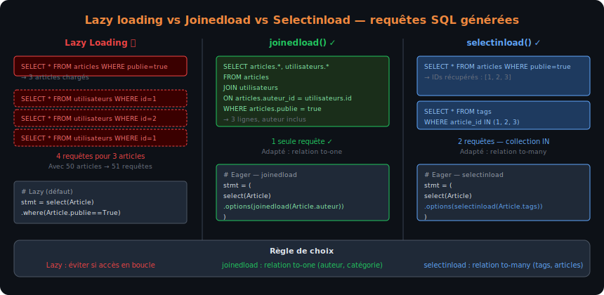
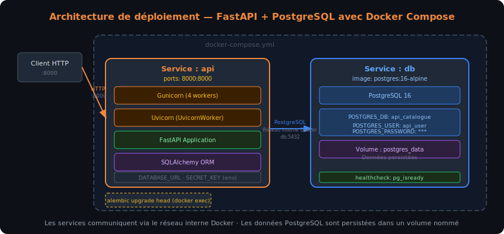

# Chapitre 5 — SQLAlchemy avancé et intégration avec FastAPI

## Objectifs du chapitre

À l'issue de ce chapitre, chaque stagiaire est capable de :

- Expliquer le lazy loading et l'eager loading et choisir la stratégie adaptée
- Identifier et corriger le syndrome des N+1 requêtes avec `joinedload()` et `selectinload()`
- Injecter une Session SQLAlchemy par requête HTTP dans FastAPI via `Depends(get_db)`
- Concevoir les schémas Pydantic de sortie compatibles avec les modèles SQLAlchemy (`from_attributes=True`)
- Implémenter un CRUD complet (Create, Read, Update, Delete) sur des modèles persistés
- Connecter le flux d'authentification JWT au modèle `Utilisateur` en base de données
- Déployer le projet complet avec Docker Compose (API + PostgreSQL)

## Requêtes avancées et optimisations

### Lazy loading — le comportement par défaut

Par défaut, SQLAlchemy utilise le **lazy loading** pour les relations : quand on accède à un attribut de relation (ex. `article.auteur`), SQLAlchemy exécute un SELECT supplémentaire au moment de l'accès. Ce comportement est pratique mais peut devenir problématique.

```python
from sqlalchemy import select
from models import Article

stmt = select(Article).where(Article.publie == True)
articles = db.execute(stmt).scalars().all()

# Chaque accès à article.auteur exécute un SELECT supplémentaire !
for article in articles:
    print(article.auteur.username)  # SELECT * FROM utilisateurs WHERE id = ?
```

Si on récupère 50 articles et qu'on accède à leur auteur, cela génère 50 requêtes supplémentaires : c'est le syndrome des N+1.

### Le syndrome des N+1 requêtes

Le problème des N+1 (N+1 query problem) est l'une des causes les plus fréquentes de lenteur dans les applications utilisant un ORM. Il se produit quand :
1. Une première requête charge N entités (1 requête)
2. Pour chaque entité, une requête supplémentaire charge sa relation (N requêtes)
Total : **N+1 requêtes** au lieu d'une seule bien formulée.

```python
# ❌ N+1 problème
articles = db.execute(select(Article)).scalars().all()  # 1 requête
for article in articles:
    print(article.auteur.username)  # +1 requête par article → N requêtes
    # 51 requêtes pour 50 articles !
```

> [!DANGER] Le N+1 est souvent invisible en développement
> Avec 10 articles en développement, l'impact du N+1 est imperceptible. En production avec 1 000 articles, chaque appel à l'endpoint génère 1 001 requêtes SQL — la base de données est surchargée et la réponse prend des secondes. Toujours mesurer avec des outils de profiling SQL avant de déployer.

### Eager loading — charger les relations en avance

SQLAlchemy propose deux stratégies d'eager loading qui résolvent le N+1 :

**`joinedload()`** : charge les relations avec un `JOIN` dans la même requête principale. Efficace pour les relations 1-à-1 et 1-à-n côté "many" (ex. article + son auteur).

```python
from sqlalchemy.orm import joinedload

# Une seule requête avec JOIN
stmt = (
    select(Article)
    .where(Article.publie == True)
    .options(joinedload(Article.auteur))  # JOIN avec la table utilisateurs
)
articles = db.execute(stmt).unique().scalars().all()

# Maintenant article.auteur ne déclenche plus de requête SQL
for article in articles:
    print(article.auteur.username)  # Données déjà chargées — 0 requête supplémentaire
```

**`selectinload()`** : charge les relations avec une deuxième requête `IN` (plus efficace que `joinedload` pour les collections — relations 1-à-n côté "one" ou n-à-n).

```python
from sqlalchemy.orm import selectinload

# Deux requêtes : 1 pour les articles, 1 pour tous les tags en une fois
stmt = (
    select(Article)
    .options(selectinload(Article.tags))  # SELECT ... WHERE article_id IN (1, 2, 3, ...)
)
articles = db.execute(stmt).scalars().all()
```

> [!TIP] Règle de choix joinedload vs selectinload
> - `joinedload()` : relation to-one (article → auteur) — le JOIN est efficace car une seule ligne par article
> - `selectinload()` : relation to-many (utilisateur → ses articles, article → ses tags) — le JOIN duplique les lignes et `unique()` est requis, `selectinload` avec un `IN` est généralement plus propre



Le schéma ci-dessus compare les trois stratégies de chargement pour 3 articles avec leurs auteurs : lazy loading génère 4 requêtes (1 + 3×1), joinedload génère 1 requête avec JOIN, selectinload génère 2 requêtes (la collection en une seule requête IN).

### Charger plusieurs niveaux de relation

```python
# Charger articles + auteur + tags en une passe
stmt = (
    select(Article)
    .options(
        joinedload(Article.auteur),
        selectinload(Article.tags),
    )
)
```

### Requêtes avec agrégations avancées

```python
from sqlalchemy import func, case, literal_column

# Nombre d'articles publiés et non publiés par auteur
stmt = (
    select(
        Utilisateur.username,
        func.count(case((Article.publie == True, 1))).label("publies"),
        func.count(case((Article.publie == False, 1))).label("brouillons"),
    )
    .join(Article, Article.auteur_id == Utilisateur.id)
    .group_by(Utilisateur.username)
    .having(func.count(Article.id) > 0)
    .order_by(func.count(Article.id).desc())
)

# Sous-requête (subquery)
nb_articles_subq = (
    select(func.count(Article.id))
    .where(Article.auteur_id == Utilisateur.id)
    .scalar_subquery()
)
stmt = select(Utilisateur, nb_articles_subq.label("nb_articles"))
```

## Intégration SQLAlchemy dans FastAPI

### Session par requête avec Depends

L'intégration de SQLAlchemy dans FastAPI repose sur le système de dépendances : une fonction `get_db` crée une Session pour chaque requête HTTP et la ferme automatiquement à la fin, qu'il y ait eu une exception ou non.

```python
# database.py
from sqlalchemy import create_engine
from sqlalchemy.orm import sessionmaker, Session, DeclarativeBase
from typing import Generator

DATABASE_URL = "sqlite:///./app.db"
engine = create_engine(DATABASE_URL, connect_args={"check_same_thread": False})
SessionLocal = sessionmaker(autocommit=False, autoflush=False, bind=engine)

class Base(DeclarativeBase):
    pass

def get_db() -> Generator[Session, None, None]:
    """Dépendance FastAPI : crée une Session SQLAlchemy par requête HTTP."""
    db = SessionLocal()
    try:
        yield db       # La requête HTTP est traitée ici
    finally:
        db.close()     # Toujours fermé, même si une exception est levée
```

```python
# Utilisation dans un gestionnaire
from fastapi import Depends
from sqlalchemy.orm import Session
from database import get_db

@router.get("/{article_id}", response_model=ArticleReponse)
def get_article(article_id: int, db: Session = Depends(get_db)):
    article = db.get(Article, article_id)
    if article is None:
        raise HTTPException(status_code=404, detail="Article introuvable")
    return article
```

### Schémas Pydantic compatibles avec SQLAlchemy

Pour que Pydantic puisse sérialiser un objet SQLAlchemy (qui n'est pas un dictionnaire), configurer le modèle Pydantic avec `model_config = {"from_attributes": True}`.

```python
# schemas/article.py
from pydantic import BaseModel, ConfigDict
from datetime import datetime
from typing import Optional, List

class TagSchema(BaseModel):
    model_config = ConfigDict(from_attributes=True)
    id: int
    nom: str

class AuteurSchema(BaseModel):
    model_config = ConfigDict(from_attributes=True)
    id: int
    username: str

class ArticleReponse(BaseModel):
    model_config = ConfigDict(from_attributes=True)
    id: int
    titre: str
    contenu: str
    publie: bool
    date_creation: datetime
    auteur: AuteurSchema          # Relation imbriquée
    tags: List[TagSchema] = []    # Liste de tags

class ArticleCreation(BaseModel):
    titre: str
    contenu: str
    categorie: Optional[str] = None
```

> [!NOTE] `from_attributes=True` remplace `orm_mode=True`
> Depuis Pydantic v2, `orm_mode = True` (Pydantic v1) est remplacé par `model_config = ConfigDict(from_attributes=True)`. L'ancien `orm_mode` génère un avertissement de dépréciation mais fonctionne encore.

## Projet fil rouge — API catalogue complet

Cette section construit pas à pas une API de gestion d'articles avec :
- Utilisateurs persistés en base (SQLite en développement, PostgreSQL en production)
- Authentification JWT connectée à la base de données
- CRUD complet sur les articles avec pagination
- Relations auteur-articles et articles-tags

### Structure du projet final

```
api-catalogue/
├── main.py                     ← Point d'entrée
├── database.py                 ← Engine, Session, Base, get_db
├── models.py                   ← Modèles SQLAlchemy
├── schemas/
│   ├── __init__.py
│   ├── utilisateur.py          ← Schémas Pydantic Utilisateur
│   └── article.py              ← Schémas Pydantic Article
├── routers/
│   ├── __init__.py
│   ├── auth.py                 ← POST /auth/token
│   ├── utilisateurs.py         ← CRUD /utilisateurs
│   └── articles.py             ← CRUD /articles
├── auth.py                     ← JWT, hachage, dépendances
├── alembic/
│   └── versions/
├── alembic.ini
├── Dockerfile
├── docker-compose.yml
└── requirements.txt
```

### Couche de données — CRUD functions

Les fonctions CRUD sont extraites des gestionnaires pour favoriser la réutilisabilité et les tests unitaires.

```python
# crud/articles.py
from sqlalchemy.orm import Session, joinedload, selectinload
from sqlalchemy import select, func
from models import Article, Tag
from schemas.article import ArticleCreation, ArticleMiseAJour
from typing import Optional

def get_article(db: Session, article_id: int) -> Optional[Article]:
    stmt = (
        select(Article)
        .where(Article.id == article_id)
        .options(joinedload(Article.auteur), selectinload(Article.tags))
    )
    return db.execute(stmt).unique().scalar_one_or_none()


def list_articles(
    db: Session,
    skip: int = 0,
    limit: int = 10,
    publie: Optional[bool] = None,
    auteur_id: Optional[int] = None,
) -> list[Article]:
    stmt = (
        select(Article)
        .options(joinedload(Article.auteur), selectinload(Article.tags))
        .order_by(Article.date_creation.desc())
    )
    if publie is not None:
        stmt = stmt.where(Article.publie == publie)
    if auteur_id is not None:
        stmt = stmt.where(Article.auteur_id == auteur_id)
    stmt = stmt.offset(skip).limit(limit)
    return db.execute(stmt).unique().scalars().all()


def create_article(db: Session, article: ArticleCreation, auteur_id: int) -> Article:
    db_article = Article(
        titre=article.titre,
        contenu=article.contenu,
        auteur_id=auteur_id,
    )
    db.add(db_article)
    db.commit()
    db.refresh(db_article)
    return db_article


def update_article(db: Session, article_id: int, update: ArticleMiseAJour) -> Optional[Article]:
    db_article = db.get(Article, article_id)
    if db_article is None:
        return None
    for field, value in update.model_dump(exclude_none=True).items():
        setattr(db_article, field, value)
    db.commit()
    db.refresh(db_article)
    return db_article


def delete_article(db: Session, article_id: int) -> bool:
    db_article = db.get(Article, article_id)
    if db_article is None:
        return False
    db.delete(db_article)
    db.commit()
    return True
```

### Routeur Articles complet

```python
# routers/articles.py
from fastapi import APIRouter, Depends, HTTPException, Query
from sqlalchemy.orm import Session
from database import get_db
from auth import get_current_user, UtilisateurDansToken
from schemas.article import ArticleCreation, ArticleMiseAJour, ArticleReponse
from crud import articles as crud_articles
from typing import List, Optional

router = APIRouter(prefix="/articles", tags=["Articles"])


@router.get("/", response_model=List[ArticleReponse])
def list_articles(
    page: int = Query(default=1, ge=1),
    taille: int = Query(default=10, ge=1, le=100),
    publie: Optional[bool] = None,
    db: Session = Depends(get_db),
):
    skip = (page - 1) * taille
    return crud_articles.list_articles(db, skip=skip, limit=taille, publie=publie)


@router.post("/", response_model=ArticleReponse, status_code=201)
def create_article(
    article: ArticleCreation,
    db: Session = Depends(get_db),
    current_user: UtilisateurDansToken = Depends(get_current_user),
):
    return crud_articles.create_article(db, article, auteur_id=current_user.id)


@router.get("/{article_id}", response_model=ArticleReponse)
def get_article(article_id: int, db: Session = Depends(get_db)):
    db_article = crud_articles.get_article(db, article_id)
    if db_article is None:
        raise HTTPException(status_code=404, detail=f"Article {article_id} introuvable")
    return db_article


@router.patch("/{article_id}", response_model=ArticleReponse)
def update_article(
    article_id: int,
    update: ArticleMiseAJour,
    db: Session = Depends(get_db),
    current_user: UtilisateurDansToken = Depends(get_current_user),
):
    db_article = crud_articles.get_article(db, article_id)
    if db_article is None:
        raise HTTPException(status_code=404, detail="Article introuvable")
    if db_article.auteur_id != current_user.id and not current_user.est_admin:
        raise HTTPException(status_code=403, detail="Vous ne pouvez modifier que vos propres articles")
    updated = crud_articles.update_article(db, article_id, update)
    return updated


@router.delete("/{article_id}", status_code=204)
def delete_article(
    article_id: int,
    db: Session = Depends(get_db),
    current_user: UtilisateurDansToken = Depends(get_current_user),
):
    db_article = crud_articles.get_article(db, article_id)
    if db_article is None:
        raise HTTPException(status_code=404, detail="Article introuvable")
    if db_article.auteur_id != current_user.id and not current_user.est_admin:
        raise HTTPException(status_code=403, detail="Action non autorisée")
    crud_articles.delete_article(db, article_id)
```

### Authentification avec base de données

Contrairement au Chapitre 3 où les utilisateurs étaient stockés en mémoire, l'authentification s'appuie ici sur la table `utilisateurs`.

```python
# auth.py — version base de données
from sqlalchemy.orm import Session
from sqlalchemy import select
from models import Utilisateur

def get_utilisateur_par_username(db: Session, username: str) -> Optional[Utilisateur]:
    return db.execute(
        select(Utilisateur).where(Utilisateur.username == username)
    ).scalar_one_or_none()

def authentifier_utilisateur(db: Session, username: str, password: str) -> Optional[Utilisateur]:
    user = get_utilisateur_par_username(db, username)
    if user is None or not pwd_context.verify(password, user.hashed_password):
        return None
    return user
```

```python
# routers/auth.py — version base de données
@router.post("/token", response_model=TokenReponse)
async def login(
    form_data: OAuth2PasswordRequestForm = Depends(),
    db: Session = Depends(get_db),
):
    user = authentifier_utilisateur(db, form_data.username, form_data.password)
    if not user:
        raise HTTPException(status_code=401, detail="Identifiants incorrects",
                            headers={"WWW-Authenticate": "Bearer"})
    token = creer_jeton({"sub": str(user.id)})  # On encode l'ID, pas le username
    return {"access_token": token, "token_type": "bearer"}
```

```python
# get_current_user — version base de données
async def get_current_user(
    token: str = Depends(oauth2_scheme),
    db: Session = Depends(get_db),
) -> Utilisateur:
    exc = HTTPException(status_code=401, detail="Jeton invalide",
                        headers={"WWW-Authenticate": "Bearer"})
    try:
        payload = jwt.decode(token, SECRET_KEY, algorithms=[ALGORITHM])
        user_id: str = payload.get("sub")
        if user_id is None:
            raise exc
    except JWTError:
        raise exc
    user = db.get(Utilisateur, int(user_id))
    if user is None or not user.est_actif:
        raise exc
    return user
```

> [!NOTE] Encoder l'ID ou le username dans le JWT ?
> Encoder l'`id` (entier) est préférable au `username` : si l'utilisateur change de nom, le jeton existant reste valide. L'`id` ne change jamais. En revanche, n'encodez jamais d'informations liées aux permissions dans le JWT (est_admin, rôles) — ces informations doivent être rechargées depuis la base à chaque requête pour refléter les changements en temps réel.

### Enregistrement des utilisateurs

```python
# crud/utilisateurs.py
from passlib.context import CryptContext
from models import Utilisateur
from schemas.utilisateur import UtilisateurCreation

pwd_context = CryptContext(schemes=["bcrypt"], deprecated="auto")

def create_utilisateur(db: Session, user: UtilisateurCreation) -> Utilisateur:
    # Vérifier que le username et l'email ne sont pas déjà pris
    existing = db.execute(
        select(Utilisateur).where(
            (Utilisateur.username == user.username) | (Utilisateur.email == user.email)
        )
    ).scalar_one_or_none()

    if existing is not None:
        raise HTTPException(
            status_code=409,
            detail="Un compte avec ce nom d'utilisateur ou cet email existe déjà"
        )

    hashed = pwd_context.hash(user.password)
    db_user = Utilisateur(
        username=user.username,
        email=user.email,
        hashed_password=hashed,
    )
    db.add(db_user)
    db.commit()
    db.refresh(db_user)
    return db_user
```

### Déploiement avec Docker Compose

```yaml
# docker-compose.yml — stack complète
services:
  api:
    build: .
    ports:
      - "8000:8000"
    environment:
      DATABASE_URL: postgresql://api_user:api_password@db:5432/api_catalogue
      SECRET_KEY: ${SECRET_KEY}
    depends_on:
      db:
        condition: service_healthy
    restart: unless-stopped

  db:
    image: postgres:16-alpine
    environment:
      POSTGRES_DB: api_catalogue
      POSTGRES_USER: api_user
      POSTGRES_PASSWORD: api_password
    volumes:
      - postgres_data:/var/lib/postgresql/data
    ports:
      - "5432:5432"
    healthcheck:
      test: ["CMD-SHELL", "pg_isready -U api_user -d api_catalogue"]
      interval: 5s
      timeout: 5s
      retries: 5

volumes:
  postgres_data:
```

```dockerfile
# Dockerfile
FROM python:3.11-slim
WORKDIR /app
COPY requirements.txt .
RUN pip install --no-cache-dir -r requirements.txt
COPY . .
EXPOSE 8000
CMD ["gunicorn", "main:app", "--workers", "4",
     "--worker-class", "uvicorn.workers.UvicornWorker",
     "--bind", "0.0.0.0:8000"]
```

```bash
# Lancer la stack
docker compose up --build

# Appliquer les migrations dans le conteneur API
docker compose exec api alembic upgrade head

# Vérifier les logs
docker compose logs -f api
```



Le schéma ci-dessus illustre la stack de déploiement Docker Compose : le service `api` (Gunicorn + Uvicorn + FastAPI) expose le port 8000 et se connecte au service `db` (PostgreSQL 16) via le réseau interne Docker. Le volume `postgres_data` persiste les données entre les redémarrages.

## Tests d'intégration avec base de données

### Base de données de test (SQLite en mémoire)

```python
# tests/conftest.py
import pytest
from sqlalchemy import create_engine
from sqlalchemy.orm import sessionmaker
from fastapi.testclient import TestClient
from database import Base, get_db
from main import app

SQLALCHEMY_TEST_URL = "sqlite:///:memory:"

@pytest.fixture(scope="function")
def db_test():
    """Crée une base SQLite en mémoire, réinitialisée pour chaque test."""
    engine = create_engine(SQLALCHEMY_TEST_URL, connect_args={"check_same_thread": False})
    Base.metadata.create_all(bind=engine)
    SessionTest = sessionmaker(autocommit=False, autoflush=False, bind=engine)
    db = SessionTest()
    try:
        yield db
    finally:
        db.close()
        Base.metadata.drop_all(bind=engine)

@pytest.fixture(scope="function")
def client(db_test):
    """TestClient avec la dépendance get_db remplacée par la DB de test."""
    def override_get_db():
        try:
            yield db_test
        finally:
            pass  # Fermeture gérée par la fixture db_test

    app.dependency_overrides[get_db] = override_get_db
    with TestClient(app) as c:
        yield c
    app.dependency_overrides.clear()
```

```python
# tests/test_articles.py
def test_crud_article_complet(client):
    # 1. Créer un utilisateur
    client.post("/utilisateurs/", json={
        "username": "test_user",
        "email": "test@ex.com",
        "password": "secret123"
    })

    # 2. Obtenir un jeton
    r = client.post("/auth/token", data={"username": "test_user", "password": "secret123"})
    token = r.json()["access_token"]
    headers = {"Authorization": f"Bearer {token}"}

    # 3. Créer un article
    r = client.post("/articles/", json={"titre": "Test article", "contenu": "Contenu test"},
                    headers=headers)
    assert r.status_code == 201
    article_id = r.json()["id"]

    # 4. Lire l'article
    r = client.get(f"/articles/{article_id}")
    assert r.status_code == 200
    assert r.json()["auteur"]["username"] == "test_user"

    # 5. Modifier
    r = client.patch(f"/articles/{article_id}", json={"publie": True}, headers=headers)
    assert r.json()["publie"] is True

    # 6. Supprimer
    r = client.delete(f"/articles/{article_id}", headers=headers)
    assert r.status_code == 204

    # 7. Vérifier la suppression
    r = client.get(f"/articles/{article_id}")
    assert r.status_code == 404
```

## Récapitulatif de la semaine — du Web Service à l'API persistée

Cette formation a couvert l'intégralité du chemin entre une requête HTTP et une base de données relationnelle, en Python, avec les outils les plus adoptés de l'écosystème backend moderne.

**Jour 1 (Chapitre 1)** : concepts Web Services, HTTP, architecture REST, FastAPI et son positionnement, mise en place de l'environnement.

**Jour 2 (Chapitre 2)** : routage complet avec APIRouter, paramètres de chemin/query/corps, validation Pydantic, gestion des erreurs, traitements asynchrones.

**Jour 3 (Chapitre 3)** : système de dépendances, authentification OAuth2/JWT, CORS, tâches de fond, tests pytest, conteneurisation Docker.

**Jour 4 (Chapitre 4)** : principe ORM, SQLAlchemy Engine/Session/Base, modèles déclaratifs, relations (1-à-n, 1-à-1, n-à-n), migrations Alembic, requêtes CRUD.

**Jour 5 (Chapitre 5)** : lazy/eager loading, N+1, intégration SQLAlchemy + FastAPI via `Depends`, CRUD complet persisté, projet fil rouge, déploiement Docker Compose.

```
Requête HTTP
    ↓
Uvicorn (ASGI)
    ↓
FastAPI Router (routing, dépendances)
    ↓
Pydantic (validation des entrées)
    ↓
Gestionnaire (logique métier)
    ↓
SQLAlchemy Session (CRUD, jointures)
    ↓
PostgreSQL (persistance)
    ↑
SQLAlchemy ORM (résultats → objets Python)
    ↑
Pydantic response_model (filtrage de la sortie)
    ↑
FastAPI (sérialisation JSON)
    ↑
Réponse HTTP (200 / 201 / 204 / 404 / ...)
```
